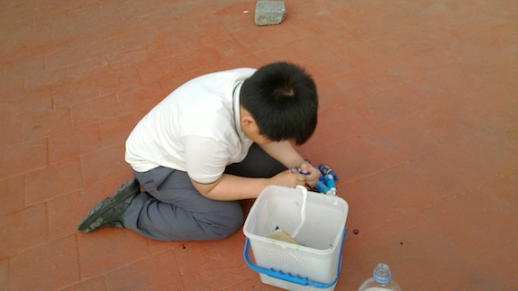
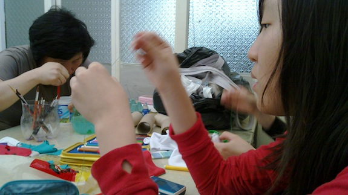
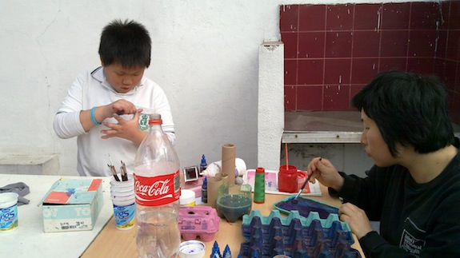

  
  
  
  
  
  
  
  
  
  
  
  
  
  
  
  
  
  
  
  
  
  
  
  
  
  
  
  
  
  
  
  
  
  
  
  
  
  
  
  
  
  
  
  
  
  
  
  
  
  
  
  
  
  
  
  
  
  
  

**Expressive Arts for children** from the Korean community on Buenos Aires, with the porpose to create a space for experimentation in a climate of acceptance, empathy and congruence.

<iframe src="//player.vimeo.com/video/17249601?title=0&amp;byline=0&amp;portrait=0&amp;color=ffffff" width="574" height="323" frameborder="0" webkitallowfullscreen mozallowfullscreen allowfullscreen></iframe>
