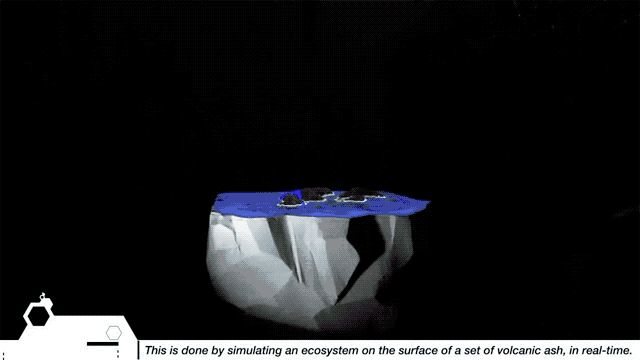

On Saturday June 4, 2011, after decades of inactivity, Puyehue Volcano ejected a plume of ash 10 kilometers high and 5 wide. This led to a natural disaster with strong environmental and financial impacts in the region. At the same time, the ash killing thousands of living beings ensures the fertility of the region for years to come

The same ash is the raw material of this work. EfectoMariposa (Spanish for "Butterfly Effect") is an interactive installation that provides the opportunity to explore destruction and creation, which are combined in an infinite fractal dance, demonstrating the ability of life to cut through the face of adversity.
                

This is done by simulating an ecosystem over the surface of an ash heap. The user can modify with his own hands the "topology"and the "atmosphere" of this virtual world, unleashing all sorts of climatic and topographic changes that directly influence the conditions of life.

The invitation is to alternate the perception between the micro and the macro scale to discover the complexity and richness of the world around us, as well as to realize our participation and responsibility in this whole.

