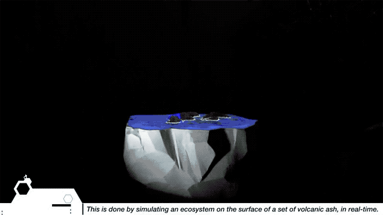

On Saturday June 4, 2011, after decades of inactivity, the Puyehue volcano ejected a plume of ash ten kilometers high. The eruption destroyed thousands of living beings across the region. That same ash would guarantee the fertility of the soil for years to come.

The same ash is the surface of this work.

*Efecto Mariposa* is an interactive installation built on a bed of that volcanic ash. Visitors reach in with their hands and reshape it, raising ridges, opening valleys, redirecting what might become a river. A depth sensor reads every change to the surface and feeds it into a simulation that renders the consequences across four interconnected layers: geology, hydrology, atmosphere, and life.

The layers do not respond at the same speed. Geological change is immediate: reshape the ash and the topography shifts at once. The hydrosphere follows: rivers carve new paths through the altered contours, moisture redistributes through the simulated air. But life is the slowest of all. It is destroyed the moment the ground shifts significantly beneath it. And then it takes a long time to return, to root itself in the changed terrain and begin again. That asymmetry is not a technical detail. It is the subject of the work.

The installation opens with a simple invitation: reach in and touch. The ash shifts under your hands, and the world above responds: rivers find new courses, moisture moves, the simulated landscape settles into a new configuration. The connection between the gesture and its effects is immediate, and the pleasure of it is real.

What takes longer to perceive is the depth of those connections. Playing with the surface, visitors begin to notice that life returns at its own pace, that some things recover quickly while others take time, that smaller adjustments leave more room for watching, that the space between one touch and the next is also part of the piece. The awareness of complexity arrives through the hands, quietly, as the system reveals more of itself the longer you stay with it.

*Efecto Mariposa* (Spanish for "butterfly effect") was presented at FILE Festival São Paulo, 2011. The ash that forms its surface was already a consequence when it arrived: geological force crystallized into mineral, destruction and future fertility held in the same grain.
