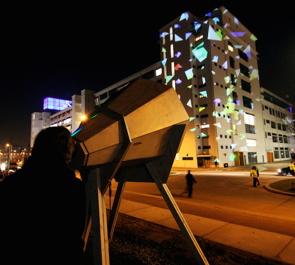

### The Megaphone

##### Interactive Installation + Building Projection 

For the GLOW festival in Eindhoven, we created an oversize megaphone that allows you to shout at a building across the street and paint it. &nbsp;We had several scenes that focused on writing and text -- a swirling pile of papers that your voice levitates, an abstract typeface and individual letterforms. 

### Credits

Software Research and Development:
Zach Lieberman

Electronic Research and Development:
Molmol Kuo

Software Development:
Patricio Gonzalez Vivo
Elie Zananiri

Megaphone Construction:
Jan Dams 