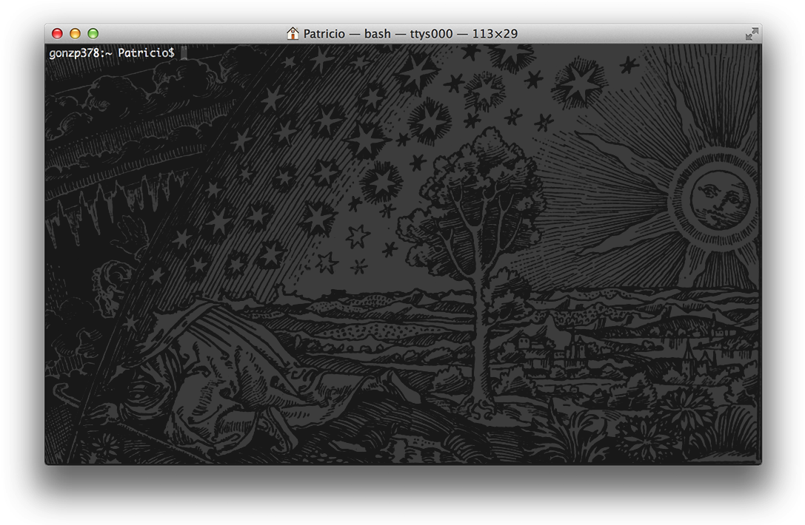

Not so long time ago just before the [Bell's Chambers release the Unix](http://www.youtube.com/watch?v=tc4ROCJYbm0), before the gestures, clicks and drags arrive, the world was dark and cold. People used to know how to move through shadows and consoles. They knew the secrets spells to speak with [daemons](http://en.wikipedia.org/wiki/Daemon_computing), and made the [echo](http://en.wikipedia.org/wiki/Echo_command) talk. That was the time of the [Midnight Commander](http://en.wikipedia.org/wiki/Midnight_Commander) and the [Emacs](http://en.wikipedia.org/wiki/Emacs). Hard times that forge hard mens. Rules were wrote on code and blended with [shell pipes](http://www.dsj.net/compedge/shellbasics1.html).

That old days have passed. Now everything is bright and round, but that power still remains in the shadows. In silence wait those brave enough who decide to learn the secret words that unleash the ancient occult powers of your domains.

## Index

1. [The gate](chapter.php?file=chap01.md): terminal basics knowledge

2. [Trees and Soil](chapter.php?file=chap02.md): directory structure and filesystem

3. [The Cosmic dance](chapter.php?file=chap03.md): jobs controls
 
  a. [Screen](chapter.php?file=chap03a.md)

4. [The Harvest](chapter.php?file=chap04.md): every day working on Unix

5. [The marriage](chapter.php?file=chap05.md): networking, Unix and the internet

6. [The Opus](chapter.php?file=chap06.md): developing directly from console

  a. [Emacs](chapter.php?file=chap06a.md)

  b. [Vi](chapter.php?file=chap06b.md)

  c. [Git](chapter.php?file=chap06c.md)
