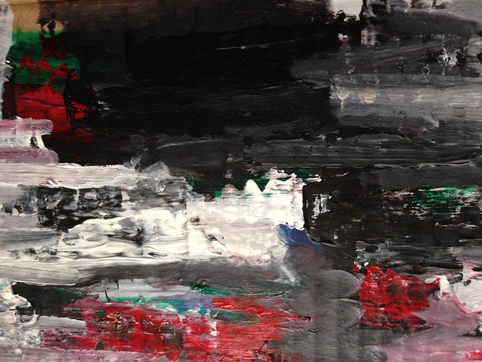

# 2.The Process 

## 2.a.Early experiments with the vPlotter

**October 12, 2013** I assembled my first Plotter prototype based on [Alexander Weber's code and designs](http://tinkerlog.com/2011/09/02/der-kritzler/). This version used an Arduino to control the steppers' drivers and servo motors. This Arduino was receiving instructions from an OpenFrameworks application I coded through the USB serial port.

Because of my original intentions of plotting maps with this tool, I concentrated most of my efforts on resolving problems regarding precision. The movement of the plotter heads presents a lot of vibrations coming from the motors.

<iframe class="vine-embed" src="https://vine.co/v/hHVwPTU7M03/embed/simple" width="575" height="575" frameborder="0"></iframe>

After experimenting with different markers, surfaces, electronic components (capacitors to compensate the excess energy between the steps of the motor) and software settings (such us augmenting/reducing/smoothing the steps per line), I discovered that the biggest enhancement was using a sponge to hold the pen. This soft material successfully absorbed most of the vibrations, generating constant straight lines.

**October 14,2013** I'm happy to say the plotter is working better. Although after showing some plotting samples to Martin Mazorra (at that time my PrintMaking teacher), we agreed on the value of the plotter as a bridge between analog and digital and not as a tool of precision. Since then I've start working on my own techniques to jump between mediums.

I started by using images related to the _"virtual world"_, like desktop icons, to plot (also by that time I was very interested in the desktop as a common metaphor for computer environments). These images were plotted on top of linoleum to then be carved and printed as a print relief.

<iframe class="vine-embed" src="https://vine.co/v/hw7g3FgDjnt/embed/simple" width="285" height="285" frameborder="0"></iframe> 

**October 21, 2013** After the first test with the icons I decided to go further adding more texture to the prints. I decided to work with wood because of its beautiful irregular texture.

**October 30, 2013** I became interested in how to achieve gradient patterns using just the line of the marker. Researching I found [this interesting paper](http://archive.bridgesmathart.org/2005/bridges2005-301.pdf" target="_blank") proposing populating the surface of an image with points using a dithering algorithm, then applying a voronoi relaxation between them, and finally apply a Traveling Salesman Problem (TSP) solver to get a constant uninterrupted line between them. This approach seems to work pretty well on paper but is very difficult to carve on wood. Also I found that was necessary to add 

<iframe class="vine-embed" src="https://vine.co/v/hjFOWWmLBWz/embed/simple" width="575" height="575" frameborder="0"></iframe>

## 2.b.Traces of the digital

**November 16, 2013** What type of visual techniques are commonly related to digital mediums? I have been working on translating images from one medium to another. But in the end the work of my hands over the irregular surface of the wood erases almost all traces of the original virtual nature of the images. By generating images that clearly speak of their digital origins, I want to generate some intrinsic tension when they become clearly analog.

With that in mind I made my own slit cam combining my own GLSL Shader with the camera input.

The second step was to extract the contours of the image applying a Computer Vision _"Canny Edge Detection"_ algorithm.

<iframe class="vine-embed" src="https://vine.co/v/htvlF5mhKpu/embed/simple" width="575" height="575" frameborder="0"></iframe>

After doing that I repeat the process of plotting on top of a peace of wood.

> _"At first you question the model (the seven irises) in order to discover lines, shapes, tones that you can trace on the paper. The drawing accumulates the answers. Also, of course, it accumulates corrections, after further questioning of the first answers. Drawing is correcting. [...] At a certain moment - if you're lucky - the accumulation becomes an image."_ John Berger, 2011

One iteration of the plotter was not enough. The jumps and spaces left by the Canny Algorithms weren't coherent enough. I discovered that running the edge detection several times and letting these traces accumulate resulted in more dramatic and rich borders.

In the print shop this process paid off. The digital nature of the slitCam, the repetition of the edge detection algorithm, the organic surface of the wood with their imperfection and the work of my hands combine in a fluid image whose nature is unclear.

**December 2, 2013** I repeat the process. Makes me feel like an alchemist of mediums. The products of this process are dense and obscure at the same time superficial, incomplete.

<iframe class="vine-embed" src="https://vine.co/v/hP3Y9erJMLr/embed/simple" width="285" height="285" frameborder="0"></iframe> 

## 2.c.Research and experiment about glitch

The term glitch usually refers to a technical error that leads to unexpected behavior in a system. As a clear example of ["The New Aesthetics"](http://booktwo.org/notebook/sxaesthetic/), glitches speaks about the devices we use and the influence they have over us. But glitches become an aesthetic of their own. Digital artists like [Kim Asendorf](http://kimasendorf.com/) and [Adam Ferriss](http://adamferriss.tumblr.com/) develop glitches through code, seeking ways to exploit their aesthetic qualities. This movement is know as ["Glitch Art"](http://web.archive.org/web/20100818025410/http://www.wired.co.uk/news/archive/2010-08/17/glitch-art-databending) and has many members, celebrities, conventions and festivals (ex: [GLIT.CH](http://rhizome.org/editorial/2010/oct/13/code-eroded-at-glitch/#c63266) ).

**February 6, 2014** Intrigued by the poetic potential of this phenomena, I wonder about its limits. Do glitches manifest outside the digital? The work of [Gerhard Richter](http://www.gerhard-richter.com/) and [Tintin Cooper](http://tintincooper.com/filter/collage) seem to challenge that idea. They are an example of how this aesthetic has filtered into non-digital mediums, as something recognizable and with its own agency. Both artists depart from photographs to then apply different treatments that evoke technical errors. Blurs and JPEG coding seems to emerge in the analog medium.

I feel inspired by these two artists. I have the feeling that by experimenting with the translation of mediums, I will understand more about the nature of the glitch. Like a research exercise led by the body. My hands and eyes will engage in a conversation with textures, movements and colors. I will just need to observe that process.

After weeks of [collecting glitches in a Pinterest Board](http://www.pinterest.com/patriciogonzv/slit-glitch/" target="_blank") [one image is the chosen one](http://robertdelnaja.tumblr.com/post/41636057857" target="_blank"), and I start to make my experiment. I grab a cardboard and start sketching the profile of it, then the whites and at last the blacks and grays. Now is the moment of the glitch. Following the directions on the image I add greens, reds and blue distortions. The colors don't mix in the right way. I remember about difference of pigment and light color theories. This is getting harder.

<iframe class="vine-embed" src="https://vine.co/v/MaTYbehBQPl/embed/simple" width="575" height="575" frameborder="0"></iframe>

For most of the painting, I used the brush but its trails were too smooth to mimic the edgy shapes of the glitch. The spatula was a better tool for that. Spasmodic horizontal moves are better. I concentrate on that movement. I change the angle of the spatula in an attempt to distort the maximum amount of paint per movement. Instead the paints seems to "jump" over the surface. The wavy surface of the cardboard dictated by its own structural composition gets exposed. The glitch appears. It isn't the glitch I expected, but I think it's off course; it is a cardboard glitch.

The jumps expose the structure of this system composed by acrylic paint over cardboard in the same way glitches expose the encoding algorithms of the pixels on digital images. Taking distance from the painting these jumps are all over, they quietly  influence the image by adding texture to it. As the PAL/NTSC, super8 and old televisions they provide a singular and recognizable fingerprint to the image. A technological ghost scripted into the medium. I think of Instagram and all the cameras and films that they mimic.

 _"Any fixed contour is in nature arbitrary and impermanent. What is on either side of it tries to shift it by pushing or pulling."_ John Berger, 2011

The structure of the medium pushes over the image. In my paint the acrylic is dense and offers resistance. It pulls back. But digital images don't. They are like flags in the wind.

**February 11, 2014** I start a second experiment. This one is about the non-resistance of digital images. Rows of pixels of a picture will be pushed by a column of pixels of a second one. The exercise will be better if the picture is a texture, a photograph that can evoke the feeling of a surface. I also collect these types of [images on a Pinterest board, I find them useful](http://www.pinterest.com/patriciogonzv/textures/" target="_blank"), like spices on kitchen shelves. One single image is distorted over and over again using different textures. The image never fights back, it is submissive and receives the distortion.

<iframe src="//player.vimeo.com/video/88201493?title=0&amp;byline=0&amp;portrait=0&amp;color=ffffff" width="574" height="264" frameborder="0" webkitallowfullscreen mozallowfullscreen allowfullscreen></iframe>

It's hard to tell how recognizable the structural ghost of the texture used to distort the image is. The texture is evoked mostly by the quality of the movement. The limitation of this experiment consists of the dimension of the displacement. It only happened in one dimension; the whole image is distorted just by one column of the second one (the one we call the texture). The eye barely reconstructs the underlying surface one row at a time, like slices of ultrasound examination.

Because the image has been distorted equally in one direction (left to right) it is easy to un-glitch. By pulling back in the opposite direction of the push, we can flatten this surface again.

**February 15, 2014** My wife and I had the chance to make a short trip to Pittsburg. Watching the landscape change I saw mountains in a different way, now there were glitches. They expose an underlying system of tectonic plates; they are geo-glitches. Mountains have always evoked my emotions; I think about Berger's words - the pull and push of the landscape against the sky defining a contour. This contour is the background of our experiences. The tension of forces shape a scenario where our moments happen. Deserts, cities, forest, all of them have a distinctive profile, the exposure of the fabric of the earth, the cardboard mark of our location.

What happens if I try to un-glitch these geological irregularities? What happens if the tension of the contour that John Berger referenced, is raised to zero?

Re-using an algorithm develop together with [Zach Lieberman](http://thesystemis.com/) I could push back each column of pixels according to an arbitrary horizon. Like inverse sound waves that cancel each other, I visually compensate the forces of the earth over the contour of the skyline. The result is a peaceful landscape. A silent image. But looking closely, the forces of nature are trapped in a vigorous tension. The calmness is just a projection of our power. Our desire instrumented by the digital medium is temporary and superficial. This scene could explode any time, like a flooded river, nature will reclaim its power.

## 2.d.Ode to Slow Media

**February 28, 2013** At the beginning of the Fall of 2013 I was interested in virtual environments, especially with the common adopted metaphor of a Desktop. If our life is becoming more and more digital, what are the consequences of always interacting from a "desktop"? How is our awareness influenced by the fact that we remain constantly in a digital working environment without closing time, days off, lunch breaks, sunsets, sacred spaces and celebrations.

I did a couple of experiments in this area. Trying to imagine a 3D environment that reacts to the time of the day, the task we are doing and the time we have been spending on it.

<iframe src="//player.vimeo.com/video/77456638?title=0&amp;byline=0&amp;portrait=0&amp;color=ffffff" width="574" height="359" frameborder="0" webkitallowfullscreen mozallowfullscreen allowfullscreen></iframe>

These were superficial interventions. For me, the problem was in the point of view in itself. We were still looking at the screen: shiny glowing images, digitally modified or generated. Mass produced in a glimpse of a second, instantly broadcasted, shared and copied. These images are taking over. We are staring at them. We are losing awareness by being distracted by the shininess of the digital imaginary.

> _“Videos, photographs and graphic images tend to fade in the white noise of mass culture, whereas carefully chosen image, an image made out of accurate, thoughtful brushstrokes (or any other carefully considered technique for that matter), an image that carries the wight of human touch - of human presence, of repeated analysis, of intense gazing - a full-resolution image, life-size and in real time - can be just as miraculous today as that fresco in the remote late medieval chapel.”_ Marc Valli

Time to experiment with another media. Time to think with my hands and body. For me, drawing and painting can trigger a dialog of thoughts better than any other medium.

<iframe class="vine-embed" src="https://vine.co/v/MW79j3aqAHJ/embed/simple" width="575" height="575" frameborder="0"></iframe>

Drawing are conceived as the natural and intuitive tool for ideas to be born. The double nature of connecting the material, sharable and tangible 2D world of paper with the invisible, cryptic and silent world of the mind allows ideas to shape themselves in a dialog that goes from the paper to the creator. Impossible new thoughts find ways to reality though the pencil, and by leaving their mark, form the basis for new thoughts. As matches lighting each other, drawing becomes the space between spaces, the conduction between ideas and thoughts.

> _"Since drawing can mediate between perception and reflection, it plays a constitutive role in the production and communication of knowledge"_ Gansterer, 2011

There is also something about the time. It takes time to mix the right proportions of pigments to match a color. It takes time to get the right proportions of a model. It takes time for the hand to trace a contour. It takes time for the brush to fill a space. It takes time for the paint to dry out. Analog mediums are slow. But it is that slowness that holds and opens a space in time to think, observe, contemplate and meditate. It is that slowness of analog mediums which holds thoughts and awareness.

> _"The drawn hypothesis attempts to extend the space of the
conjectural, deferring or delaying the effects of consequential thinking in order to keep the if in flight."_ Cocker, 2011

**March 27, 2014** Painting and drawings are carefully curated images. Slowly generated. They also require time to observe them. They reveal their content through time, to a patient observer. Contemplation is a slow viewing practice, one that also allows thinking, that opens a dialog with the author.

> _"Painting has offered an option - it is almost a lifestyle option - to the contemporary artist. It’s slower rhythms allow for a more intimate connection to human perception (which is true both from the point of view of the artist and the viewer). For example the need for models connects painting to the intricacy of human relationships.”_ Marc Valli

At this point, I was more sure on the direction of my work. The tools I was making should be slow. Should use the timelessness and tirelessness of machines to enhance and expand our perception, not to speed it up and block it. My machines should be a provocation to this world of fast images. They should slow the observer down. Make them wonder and question.

Machines originated as an assistive technology and it's important to make a clear point of that.

After winning World War II deciphering enigma our relationship with machines shifted. Machines become powerful entities that should be assisted by humans to process information. On _The Psychology of Human-Computer Interaction_, Card, Stuart K., Thomas P. Moran, and Allen Newell propose a human information processor model called GOMS (for Goals, Operators, Methods, and Selection rules). Besides the major breakthrough that this represents for its time, what is very interesting to note is the conception of human. From the epistemological frameworks and school of psychology the conception of human is based on a mechanical reduction of the human mind. Users are meant to be complex data processor entities that by connecting humans with the tireless power of the computer can bring us to a new era, but as Lanier says: _"This ideology promotes radical freedom on the surface of the web, but that freedom, ironically, is more for machines than people."_

> _"The role psychology might be expected to play in the design of the user-computer interface is suggested by the results it was able to achieve for military equipment during World War II. At that time, it had become apparent that a strong limiting factor in realizing the potential of man- machine systems, such as radar sets and military aircraft, lay in the difficulty of operating the equipment. Out of a wartime collaboration between natural scientists, engineers and psychologists came major advances, not only with respect to the man-machine systems being designed, but also with respect to psychological theory itself. Examples of the latter include the theory of signal detection, manual control theory, and a methodology for the design of cockpit instrument displays. That with psychological attention to human performance airplanes become more flyable encourages us to believe that with psychological attention to human performance computers can become more usable"_ Card, Stuart K., Thomas P. Moran, and Allen Newell. 1983

The human-computer dream was one where humans can be plugged into computers in an intuitive and efficient way. By intuitive and efficient these fields understand: without too much previous explanation and without the human making mistakes. Because the psychological model behind this research is a reduction of the human psyche to terms of electronics circuits (buffers, memory, processors, inputs and outputs) the beginning of the human-computer interaction represents a project where engineers and psychologists trace the basis of how to design computers for human-computers.

> _Machines as assistive technology._

> _Machines to make us more aware._

> _To help us see beyond our perception without distractions._

> _Calmer and slower technology._

> _One that goes at our rhythm, to let us see, to make us think._

## 2.e.Skyline #01

**March 28, 2014** In our personal cognitive development and in our evolution as a species, drawing is our first technique for generating images.

Drawing sets the basis for abstract thinking at the same time as we are learning to see. In this process we initiate a dialog back and forth between our eye and our tools.

This dialog also could be between things we have seen, tracing them from memory, or with things that doesn't exist yet, drawing from the imagination. In this way, memories and ideas get shaped on paper.

Cartography behaves in the same way, tracing contours and tracking paths along landscapes. Sometimes the terrain is not real and the map is from something in our mind. The work of [Matthew Rangel](http://matthewrangelstudio.com/) is a good example of drawing as a topographical search.

> _My work is centered on the ways in which human constructs of land influence our experience of a place and I explore this notion through an embodied process of visualizing the land. My prints are inspired by the extended walks that I initiate and often comprised of influential documentation I gather that becomes integral to my experience. This includes maps, observation-based drawings, photographs, historic research, and oral narratives I gather from ethnographic field research._ Matthew Rangel

**March 30, 2014** I start using my [vPlotter Tool](http://www.patriciogonzalezvivo.com/2014/vPlooter/), this time open to be guided by it. I want to see through the eyes of this tool.
I start by drawing skylines.

<iframe class="vine-embed" src="https://vine.co/v/MehQvLHvthl/embed/simple" width="575" height="575" frameborder="0"></iframe>

One after the other.
The plotter doesn't get tired.
In fact it doesn't perceive the time.
It simply obeys the series of instructions.

Now it's clear to me, how machines expand our perception to one where tiredness and exhaustion don't exist. That means I can draw by stretching the time.

As a long exposure image in photography (see [Dan Holdsworth photo](http://www.danholdsworth.com/" target="_blank") ) I can see something invisible to my perception. See through time.

> _“I try to encourage the viewer to think about their position in relationship to the world, trying to create some kind of communion with the viewer, instead of dictating something, or surprising them.”_ [Dan Holdsworth](http://www.danholdsworth.com/" target="_blank")

I'm interested on working beyond our perception of time and space. Like in maps and long exposure pictures that necessarily imply the use of technology as an extension of our experience.

**Skyline #01** is a drawing machine that slowly reveal an image by tracing constantly the contours of the images coming from a camera. The lines add one over the other one. The machine will behave like a long exposure drawing.

## 2.f.Skyline #02

If _Skyline #01_ sees through the flow of the time. **Skyline #02** expand our perception of space.

**March 13, 2014** By moving we change our point of view. We leave behind a landscapes in the search for a new horizon.

Journey diaries or traced maps are a log of the transformations that occur during a trip, a record of the past choices.

Our perception is attached to the present. We usually fail to noticing subtle changes. In a journey, the changes on the horizon becomes invisible. The skyline changes so slowly that is imperceptible.

By using machine memory we can recreate the points that constitute a journey. Google Street maps contain an enormous set of panoramic pictures. Since 2007 our landscapes and skylines have been rigorously archived. By using this collection of memories I can reconstitute the transitions in a journey from point A to point B. In my case from Union Sq. (Manhattan) all the way up to Hudson (the town where The American Landscape was born).

To let the user observe this transition of miles and miles in just a glimpse I decide to print the stitched horizon in a big roll of paper.

For this I re-purposed a mini thermal recipe printer connected to a RaspberryPi and running an openFrameworks program that I wrote which collects and composes the horizons extracted from Google Street View.

For this process I develop series of digital tools in C++, like the [drivers for the printer](http://www.patriciogonzalezvivo.com/2014/ofxThermalPrinter/) and [TFT Display](http://www.patriciogonzalezvivo.com/2014/ofxPiTFT/), together with the C++ algorithm to extract information from Google Street View database. 

<iframe src="//player.vimeo.com/video/89982939?title=0&amp;byline=0&amp;portrait=0&amp;color=ffffff" width="574" height="326" frameborder="0" webkitallowfullscreen mozallowfullscreen allowfullscreen></iframe>

**March 23, 2014** Trying to improve the stitching between panoramic views I came across some encrypted depth information inside Google Street View database. It contains 

**April 1, 2014** I successfully incorporate the [PiTFT](http://www.patriciogonzalezvivo.com/2014/ofxPiTFT/) display into the project.

<object type="application/x-shockwave-flash" width="574" height="323" data="https://www.flickr.com/apps/video/stewart.swf" classid="clsid:D27CDB6E-AE6D-11cf-96B8-444553540000"><param name="flashvars" value="intl_lang=en-US&photo_secret=4954536a8a&photo_id=13632669745&hd_default=false"></param><param name="movie" value="https://www.flickr.com/apps/video/stewart.swf"></param><param name="bgcolor" value="#000000"></param><param name="allowFullScreen" value="true"></param><embed type="application/x-shockwave-flash" src="https://www.flickr.com/apps/video/stewart.swf" bgcolor="#000000" allowfullscreen="true" flashvars="intl_lang=en-US&photo_secret=4954536a8a&photo_id=13632669745&hd_default=false" width="574" height="323"></embed></object>

**April 16, 2014** After some failed enclosure prototypes...

...I discover an old EKG machine that seems to be a perfect host.

With some adjustment [the Mini Thermal Printer](../ofxThermalPrinter/) and the [TFT display of the RaspberryPi](../ofxPiTFT) are added. The skyline-recorder is almost ready.

 

<object type="application/x-shockwave-flash" width="574" height="323" data="https://www.flickr.com/apps/video/stewart.swf" classid="clsid:D27CDB6E-AE6D-11cf-96B8-444553540000"><param name="flashvars" value="intl_lang=en-US&photo_secret=a9a3dd0b06&photo_id=13917946995&hd_default=false"></param><param name="movie" value="https://www.flickr.com/apps/video/stewart.swf"></param><param name="bgcolor" value="#000000"></param><param name="allowFullScreen" value="true"></param><embed type="application/x-shockwave-flash" src="https://www.flickr.com/apps/video/stewart.swf" bgcolor="#000000" allowfullscreen="true" flashvars="intl_lang=en-US&photo_secret=a9a3dd0b06&photo_id=13917946995&hd_default=false" width="574" height="323"></embed></object>
