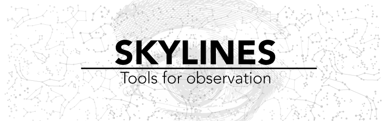

>>>> _We teach them how to see where we don't._

# Table of Contents

**1.Introduction**

> a. Through Landscapes

> b. Tools and Artist

[ **2.The Process** ](process.php)

> a.Early experiments with the vPlotter

> b.Traces of the digital

> c.Research and experiment about glitch

> d.Ode to Slow Media

> e.Skyline #01

> f.Skyline #02

**3.The Tools**

> a.[The vPlotter](../vPlotter/)

> b.[The Thermal Printer](../ofxThermalPrinter/)

# 1.Introduction

This series of projects are about awareness. More specifically about the tools and techniques we use to see the world around us.

These projects are part of a on going process nourished buy different motivations a long my last year as a Parson's MFA DT student. I found that awareness of my surroundings was the constant and repetitive presence on my works. Probably moved by my own limitations and lack of attention.

By looking at the horizon we found a _skyline_. A place where the earth and the sky touch and differentiate from each other. This contour is the confluence of time and space. The landscape is shaped over time by forces like the erosion or human hand, is  in constant change and fluctuation. Also this skyline is defined by the particular position of the observer. Seen through technical devices allow us to look beyond our perception in different qualities of time and space.

## 1.a.Through Landscapes

Landscapes, as a pictorial theme in art, speaks over all about our intention to capture the world we live in. Landscapes preserve for the future a glimpse of our context, the background of our experiences, the identity of a nation, horizon of an era.

As Rafael Cardoso said _"nature is not made up of landscapes. Although it contains mountains, valleys, plains, rivers, bays and much more, these natural forms only become "landscape" when they are framed by the viewer's gaze and grouped into compositions. The landscape thus depends on the observer's gaze just as much as on the actual physical features been observer."_
As another example, The Hudson River School, witch it panoramic vistas, deep space, deft atmospheric effect and precise details define a national grandeur identity of North America scenery.

By learning how to draw this sceneries, artist through time, understand the laws of our perception. Everything from the behavior of light to the laws of perspective was discover by learning how to see the world. In that process we develop tools, like the camera obscura, camera lucida and lenses techniques, that helps us see with more precision. Artifact were designed to assist our perception, with them our awareness of the world expand dramatically. We learn how to see further and closer, to get a better pictures of the macro context we are inserted in, together with the micro universe hided in details.

Because of the scale of our world, observation of space always have relay on technology. This force us to develop and improve technology that help us see where our eyes are blind. Pushing the limits of our perception. Binoculars, telescopes, astrolabes, compases, grids, maps, photographies and panoramic images are just some of the devices we create in this process of always looking further.

Now a days, we live in a world of images. They are easy to generate, edit and share. We produce effortless and instantaneously an enormous amount of information of the world around us like never before in history. 3D Maps, digital compass, GPS devices, panoramic cameras live in a same device on our pocket. And, this means we are more aware of our surroundings like never before?

This thesis is a meditation about this devices. An on-going process of exploration around the theme of seen assisted by apparatus.

## 1.b.Tools and Artist

Artists have been on the technological frontier since before the Renaissance. As Greg Turner and Ernest Edmonds said, _"the physical world of artifacts is very different from the conceptual world of the imagination, and artists often find themselves pushing technology forward, creating new artifacts either as part of, or in order to construct, their art. These new artifacts present new ways of using and thinking about other things.”_

Most of these artifacts, which develop the creative process, end up as custom tools for expression. Some of them have become so popular that it is impossible not to relate them to an expressive field: the brush for painting, the chisel for sculpture, the type notebook for poetry. Tools blend with the author to become extensions of their body and share the process of bringing imaginations to life. That could happen by learning how to use pre-existing tools, experimenting how to use them in new ways, or by developing new ones. In the new media scene, the latter two occur often.

> _"As long as you are not defined by software, you are helping to broaden the identity of the ideas that will get locked in for future generations."_ Lanier, 2010

Three decades after Xerox/Park research and the birth of the personal computer, digital media has become part of our time.
Computers were developed as information machines in the early stages of what was called _Information Society_ (Beniger &  Salvaggio). By this, man _"has come to be viewed as an active processor of information."_ The tools designed for this duty are the standard digital devices that we find in offices and homes, desktop computers, printers and scanners. All of these respond to standards becoming black boxes of Inputs/Outputs.

What was initially a tool for data processing slowly transformed into an expressive medium chosen by some experimental artists. As John Maeda once stated, computer technology _“is not a tool; it is a new material for expression.”_ New media artists in their search for new expressive and poetic potential make constant efforts to re-appropriate existing technology and at the same time push the limits of it into new directions.

This breaks with the passive paradigm of computer _"users"_ to install an active attitude of creators. As Mitchel Resnick said, _“computers will not live up to their potential until we start to think of them less like televisions and more like paint brushes. That is, we need to start seeing computers not simply as information machines, but also as a new medium for creative design and expression."_. Resnick emphasizes the need for turning the Information Society into a Creative Society. _“The ultimate goal is a society of creative individuals who are constantly inventing new possibilities for themselves and their communities."_

On this spirit of self-made tools, I start a series of explorations searching for new poetic potential in between old and new apparatus, and digital and analog media.

One of my biggest inspiration for this quest was William Kentridge, a famous artist that is not usually considered a new media artist, but in his work he uses a camera and a projector to construct animations. Sometimes he starts by filming himself performing different movements. Then, after editing the video, he projects it on top of a board and uses pieces of paper to animate frame by frame. In this process he is not only incorporating both digital and analog materials, he is sitting in the middle of a bigger apparatus. His studio becomes a tools in it self, and him a user and a vital part of it. This represent for me an excellent example of de-centralization of technology. In it, devices are reduced to a mere set of input and output devices that become part of a creative process that incorporates expressive potential from both worlds. This exquisite model of working teaches us about a flexible flow between _"real"_ and _"virtual"_ media, one where the artist can initialize an expansive dialog that integrates together analog and digital gestures.

As Klemmer and Hartmann warn us, _"one of the most sweeping — and unintended — transformations that the desktop computing paradigm has brought about is the extent to which the physical performance of work has homogenized."_ The expressive potential of our bodies is restrained by the same gestures we use for navigating the web and writing an e-mail. In order to explore new frontiers, we need to integrate the body in new ways by modifying and re-appropriating the available technology.

Michael Polanyi refers to our physical body as _"the ultimate instrument of all our external knowledge, whether intellectual or practical experience is always in terms of the world to which we are attending from our body."_
In this sense, digital creative processes that successfully incorporate the richness and rawness of direct manipulation of materials will result in a larger bandwidth of poetic and expressive potential.

Inspired by William Kentridge’s methodology, I dedicated the fall of 2013 to explore the boundaries between digital and physical tools. I develop a [wall plotter (vPlotter)](../vPlotter/) that later become a ket tool to think about technology and perception.

[ **[2.The Process >>]** ](process.php)