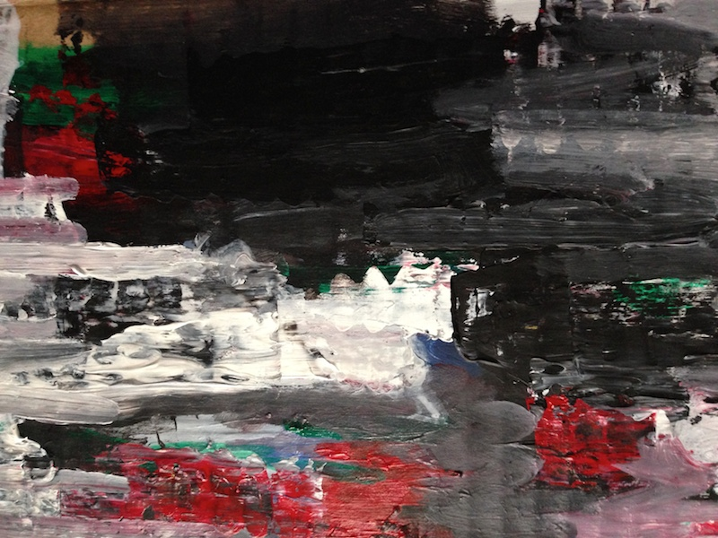

# SKYLINES
#### Tools for observation
>_We teach them how to see where we don't._

This series of projects are about awareness. More specifically about the tools and techniques we use to see the world around us. 

These projects are part of a on going process nourished buy different motivations a long my last year as a Parson's MFA DT student. I found that awareness of my surroundings was the constant and repetitive presence on my works. Probably moved by my own limitations and lack of attention.

By looking at the horizon we found a _skyline_. A place where the earth and the sky touch and differentiate from each other. This contour is the confluence of time and space. The landscape is shaped over time by forces like the erosion or human hand, is  in constant change and fluctuation. Also this skyline is defined by the particular position of the observer. Seen through technical devices allow us to look beyond our perception in different qualities of time and space.
 

## About landscapes

Landscapes, as a pictorial theme in art, speaks over all about our intention to capture the world we live in. Landscapes preserve for the future a glimpse of our context, the background of our experiences, the identity of a nation, horizon of an era.

As Rafael Cardoso said _"nature is not made up of landscapes. Although it contains mountains, valleys, plains, rivers, bays and much more, these natural forms only become "landscape" when they are framed by the viewer's gaze and grouped into compositions. The landscape thus depends on the observer's gaze just as much as on the actual physical features been observer."_
As another example, The Hudson River School, witch it panoramic vistas, deep space, deft atmospheric effect and precise details define a national grandeur identity of North America scenery.

By learning how to draw this sceneries, artist through time, understand the laws of our perception. Everything from the behavior of light to the laws of perspective was discover by learning how to see the world. In that process we develop tools, like the camera obscura, camera lucida and lenses techniques, that helps us see with more precision. Artifact were designed to assist our perception, with them our awareness of the world expand dramatically. We learn how to see further and closer, to get a better pictures of the macro context we are inserted in, together with the micro universe hided in details.

Because of the scale of our world, observation of space always have relay on technology. This force us to develop and improve technology that help us see where our eyes are blind. Pushing the limits of our perception. Binoculars, telescopes, astrolabes, compases, grids, maps, photographies and panoramic images are just some of the devices we create in this process of always looking further.

Now a days, we live in a world of images. They are easy to generate, edit and share. We produce effortless and instantaneously an enormous amount of information of the world around us like never before in history. 3D Maps, digital compass, GPS devices, panoramic cameras live in a same device on our pocket. And, this means we are more aware of our surroundings like never before?

This thesis is a meditation about this devices. An on-going process of exploration around the theme of seen assisted by apparatus.

## Tools and Artist

Artists have been on the technological frontier since before the Renaissance. As Greg Turner and Ernest Edmonds said, _"the physical world of artifacts is very different from the conceptual world of the imagination, and artists often find themselves pushing technology forward, creating new artifacts either as part of, or in order to construct, their art. These new artifacts present new ways of using and thinking about other things.”_

Most of these artifacts, which develop the creative process, end up as custom tools for expression. Some of them have become so popular that it is impossible not to relate them to an expressive field: the brush for painting, the chisel for sculpture, the type notebook for poetry. Tools blend with the author to become extensions of their body and share the process of bringing imaginations to life. That could happen by learning how to use pre-existing tools, experimenting how to use them in new ways, or by developing new ones. In the new media scene, the latter two occur often.

> _"As long as you are not defined by software, you are helping to broaden the identity of the ideas that will get locked in for future generations."_ Lanier, 2010

Three decades after Xerox/Park research and the birth of the personal computer, digital media has become part of our time. 
Computers were developed as information machines in the early stages of what was called _Information Society_ (Beniger &  Salvaggio). By this, man _"has come to be viewed as an active processor of information."_ The tools designed for this duty are the standard digital devices that we find in offices and homes, desktop computers, printers and scanners. All of these respond to standards becoming black boxes of Inputs/Outputs.

What was initially a tool for data processing slowly transformed into an expressive medium chosen by some experimental artists. As John Maeda once stated, computer technology _“is not a tool; it is a new material for expression.”_ New media artists in their search for new expressive and poetic potential make constant efforts to re-appropriate existing technology and at the same time push the limits of it into new directions.

This breaks with the passive paradigm of computer _"users"_ to install an active attitude of creators. As Mitchel Resnick said, _“computers will not live up to their potential until we start to think of them less like televisions and more like paint brushes. That is, we need to start seeing computers not simply as information machines, but also as a new medium for creative design and expression."_. Resnick emphasizes the need for turning the Information Society into a Creative Society. _“The ultimate goal is a society of creative individuals who are constantly inventing new possibilities for themselves and their communities."_

On this spirit of self-made tools, I start a series of explorations searching for new poetic potential in between old and new apparatus, and digital and analog media. 

One of my biggest inspiration for this quest was William Kentridge, a famous artist that is not usually considered a new media artist, but in his work he uses a camera and a projector to construct animations. Sometimes he starts by filming himself performing different movements. Then, after editing the video, he projects it on top of a board and uses pieces of paper to animate frame by frame. In this process he is not only incorporating both digital and analog materials, he is sitting in the middle of a bigger apparatus. His studio becomes a tools in it self, and him a user and a vital part of it. This represent for me an excellent example of de-centralization of technology. In it, devices are reduced to a mere set of input and output devices that become part of a creative process that incorporates expressive potential from both worlds. This exquisite model of working teaches us about a flexible flow between _"real"_ and _"virtual"_ media, one where the artist can initialize an expansive dialog that integrates together analog and digital gestures.
 
As Klemmer and Hartmann warn us, _"one of the most sweeping — and unintended — transformations that the desktop computing paradigm has brought about is the extent to which the physical performance of work has homogenized."_ The expressive potential of our bodies is restrained by the same gestures we use for navigating the web and writing an e-mail. In order to explore new frontiers, we need to integrate the body in new ways by modifying and re-appropriating the available technology.

Michael Polanyi refers to our physical body as _"the ultimate instrument of all our external knowledge, whether intellectual or practical experience is always in terms of the world to which we are attending from our body."_ 
In this sense, digital creative processes that successfully incorporate the richness and rawness of direct manipulation of materials will result in a larger bandwidth of poetic and expressive potential.

Inspired by William Kentridge’s methodology, I dedicated the fall of 2013 to explore the boundaries between digital and physical tools. I develop a [wall plotter (vPlotter)](../vPlotter/) that later become a ket tool to think about technology and perception.

## Early experiments with the [vPlotter](../vPlotter/)

**October 12, 2013** I finally assemble my first Plotter prototype based on [Alexander Weber's code and designs](http://tinkerlog.com/2011/09/02/der-kritzler/). This version use an Arduino to control de steppers drivers and servo motors. This Arduino was receiving instructions from an OpenFrameworks application I code throughout USB serial port.

Because my original intentions of plotting maps with this tool, I concentrate most of my efforts on resolve problems regarding precession. The movement of the plotter heads present a lot of vibrations coming from the motors. 

<iframe class="vine-embed" src="https://vine.co/v/hHVwPTU7M03/embed/simple" width="575" height="575" frameborder="0"></iframe>

After experimenting with different markers, surfaces, electronic components (capacitors to compensate the excess energy between the steps of the motor) and software settings (such us augmenting/reducing/smoothing the steps per line) I discover that the biggest enhancement was the use sponge to hold pen. This soft material successfully absolve most of the vibrations, generating constant straight lines. 

**October 14,2013** I'm happy to said the plotter is working better. Aldo after showing some plotting samples to Martin Mazorra (at that time my PrintMaking teacher) we agree on the value of the plotter as a bridge between analog and digital and not as a tool of precession. Since then I start working on my own techniques to jump between mediums.

I start by using images related to the _"virtual world"_ like desktop icons to plot (also by that time I was very interested on the desktop as a common metaphor for computers environments). This images were plot on top of a linoleum to then be carved and as a print relieve. 

<iframe class="vine-embed" src="https://vine.co/v/hw7g3FgDjnt/embed/simple" width="285" height="285" frameborder="0"></iframe> 

**October 21, 2013** After the first test with the icons I decide to go further adding more texture to the prints. I decide to work with wood because it beautiful irregular texture. 

**October 30, 2013** I become interested on how to achieve gradient patterns using just the line of the marker. Researching I found [these interesting paper](http://archive.bridgesmathart.org/2005/bridges2005-301.pdf" target="_blank") proposing populating the surface of an image with points using a dithering algorithm, to then apply a voronoi relaxation between them, to finally apply a Traveling Salesman Problem (TSP) solver to get a constant uninterrupted line between them. This approach seams to work pretty well on paper but very difficult to carve on wood. Also I found that was necessary to add 

<iframe class="vine-embed" src="https://vine.co/v/hjFOWWmLBWz/embed/simple" width="575" height="575" frameborder="0"></iframe>

## Traces of the digital 

**November 16, 2013** What type of visual techniques are commonly related to digital mediums? I have been working translating images from one medium to another. But at the end the work of my hands over the irregular surface of the wood erase almost all trace of the original virtual nature of the images. Generating images that clearly speaks of their digital origins I want to generate some intrinsic tension when they become clearly analog. 

With that in mind I made my own slit cam combining my own GLSL Shader with the camera input. 

The second step was to extract the contours of the image applying a Computer Vision _"Canny Edge Detection"_ algorithm.

<iframe class="vine-embed" src="https://vine.co/v/htvlF5mhKpu/embed/simple" width="575" height="575" frameborder="0"></iframe>

After doing that repeat the process of plotting on top of a peace of wood.

> _"At first you question the model (the seven irises) in order to discover lines, shapes, tones that you can trace on the paper. The drawing accumulates the answers. Also, of course, it accumulates corrections, after further questioning of the first answers. Drawing is correcting. [...] At a certain moment - if you' re lucky - the accumulation becomes an image."_ John Berger, 2011 

One iteration of the plotter it was not enough. The jumps and spaces left by the Canny Algorithms didn't were enough coherent. I discover that running the edge detection several times and letting accumulate this traces result on more dramatic and rich borders.

 

On the print shop this process paid off. The digital nature of the slitCam, the repetition of the edge detection algorithm, the organic surface of the wood with their imperfection and the work of my hands combine in a fluid image whose nature is unclear. 

**December 2, 2013** I repeat the process. Makes me feel like an alchemist of mediums. The products of this process are dense and obscure at the same time superficial, incomplete.

<iframe class="vine-embed" src="https://vine.co/v/hP3Y9erJMLr/embed/simple" width="285" height="285" frameborder="0"></iframe> 

## Research and experiment about glitch

The term glitch usually refers to a technical error that leads to unexpected behavior in a system. As a clear example of ["The New Aesthetics"](http://booktwo.org/notebook/sxaesthetic/), glitches speaks about the devices we use and the influence they have over us. But glitches become an aesthetic of their own. Digital artists like [Kim Asendorf](http://kimasendorf.com/) and [Adam Ferriss](http://adamferriss.tumblr.com/) develop glitches through code, seeking ways to exploit their aesthetics qualities. This movement is know as ["Glitch Art"](http://web.archive.org/web/20100818025410/http://www.wired.co.uk/news/archive/2010-08/17/glitch-art-databending) and has many members, celebrities, conventions and festivals (ex: [GLIT.CH](http://rhizome.org/editorial/2010/oct/13/code-eroded-at-glitch/#c63266) ).

**February 6, 2014** Intrigued by the poetic potential of this phenomena, I wonder about its limits. Do glitches manifest outside the digital? The work of [Gerhard Richter](http://www.gerhard-richter.com/) and [Tintin Cooper](http://tintincooper.com/filter/collage) seem to challenge that idea. They are an example of how this aesthetic has filtered into non-digital mediums, as something recognizable and with agency by it self. Both artists depart from photographs to then apply different treatments that evoke technical errors. Blurs and JPEG coding seams to emerge in analog medium. 

I feel inspired by these two artists. I have the feeling that by experimenting on the translation of mediums, I will understand more about the nature of the glitch. Like a research exercise led by the body. My hands and eyes will engage in a conversation with textures, movements and colors. I will just need to observe that process. 

After weeks of [collecting glitches in a Pinterest Board](http://www.pinterest.com/patriciogonzv/slit-glitch/" target="_blank") [one image is the chosen one](http://robertdelnaja.tumblr.com/post/41636057857" target="_blank"), I start to make my experiment. I grab a cardboard and start sketching the profile of it, then the whites and at last the blacks and grays. Now is the moment of the glitch. Following the directions on the image I add greens, reds and blue distortions. The colors doesn't mix in the right way. I remember about difference on pigment and lights color theories. This is getting harder. 

<iframe class="vine-embed" src="https://vine.co/v/MaTYbehBQPl/embed/simple" width="575" height="575" frameborder="0"></iframe>

For most of the painting, I used the brush but its trails were to smooth to mimic the edgy shapes of the glitch. The spatula was a better tool for that. Spasmodic horizontal moves are better. I concentrate on that movement. I change the angle of the spatula in an attempt to distort the maximum amount of paint per movement. Instead the paints seams to "jump" over the surface. The wavy surface of the cardboard dictated by its own structural composition gets exposed. The glitch appears. It isn't the glitch I expected, but I think it's off course; it is a cardboard glitch.

The jumps expose the structure of this system composed by acrylic paint over cardboard in the same way glitches expose the encoding algorithms of the pixels on digital images. Taking distance from the painting these jumps are all over, they quietly  influence the image by adding texture to it. As the PAL/NTSC, super8 and old televisions they provide a singular and recognizable fingerprint to the image. A technological ghost scripted into the medium. I think of Instagram and all the cameras and films that they mimic.

 _"Any fixed contour is in nature arbitrary and impermanent. What is on either side of it tries to shift it by pushing or pulling."_ John Berger, 2011 

The structure of the medium pushes over the image. In my paint the acrylic is dense and offers resistance. It pulls back. But digital images don't. They are like flags on the wind. 

**February 11, 2014** I start a second experiment. This one is about the non-resistance of digital images. Rows of pixels of a picture will be pushed by a column of pixels of a second one. The exercise will be better if the picture is a texture, a photograph that can evoke the feeling of a surface. I also collect these types of [images on a Pinterest board, I found them useful](http://www.pinterest.com/patriciogonzv/textures/" target="_blank"), like spices on kitchen shelves. One single image is distorted over and over again using different textures. The image never fights back, it is submissive and receives the distortion. 

<iframe src="//player.vimeo.com/video/88201493?title=0&amp;byline=0&amp;portrait=0&amp;color=ffffff" width="574" height="264" frameborder="0" webkitallowfullscreen mozallowfullscreen allowfullscreen></iframe>

It's hard to tell how recognizable the structural ghost of the texture used to distort the image is. The texture is evoked mostly by the quality of the movement. The limitation of this experiment consists of the dimension of the displacement. It only happened in one dimension; the whole image is distorted just by one column of the second one (the one we call the texture). The eye barely reconstructs the underlying surface one row at a time, like slices of ultrasound examination.

Because the image has been distorted equally in one direction (left to right) it is easy to un-glitch. By pulling back in the opposite direction of the push, we can flatten this surface again.

**February 15, 2014** My wife and I had the chance to make a short trip to Pittsburg. Watching the landscape change I saw mountains in a different way, now there were glitches. They expose an underlying system of tectonic plates; they are geo-glitches. Mountains have always evoked my emotions; I think about Berger's words - the pull and push of the landscape against the sky defining a contour. This contour is the background of our experiences. The tension of forces shape a scenario where our moments happen. Deserts, cities, forest, all of them have a distinctive profile, the exposure of the fabric of the earth, the cardboard mark of our location.

What happens if I try to un-glitch this geological irregularities? What happens if the tension of the contour that John Berger referee, is rased to zero?

Re-using an algorithm develop together with [Zach Lieberman](http://thesystemis.com/) I could push back each column of pixels according to an arbitrary horizon. Like inverse sound waives that cancel each other I visually compensate the forces of the earth over the contour of the skyline. The result is a peaceful landscape. A silent image. But looking closely the forces of nature are trapped in a vigorous tension. The calmness is just a projection of our power. Our desired instrumented by digital medium is temporary and superficial. This scene could explote any time, like a bolted river, nature will reclame his power. 

## Ode to Slow Media

**February 28, 2013** At the beginning of the Fall of 2013 I was interested on virtual environments, specially with common adopted metaphor of a Desktop. If our life is becoming more and more digital, what are the consequences of always been interacting from a "desktop"? How our awareness is influenced by the fact that we remain constantly in an digital working environment with out closing time, days off, launch breaks, sunsets, sacred spaces and celebrations. 

I did a couple of experiments in this area. Trying to imagine a 3D environment that reacts to the time of the day, the task we are doing and the time we have been spending on it.

<iframe src="//player.vimeo.com/video/77456638?title=0&amp;byline=0&amp;portrait=0&amp;color=ffffff" width="574" height="359" frameborder="0" webkitallowfullscreen mozallowfullscreen allowfullscreen></iframe>

This were superficial interventions. From me, the problem was in the point of view in it self. We were still looking to screen. Shiny glowing images. Digitally modify or generated. Mass produce in a glimpse of a second, instantly broadcasted, shared and copy. This images are taking over. We are staring at them. We are loosing awareness by been distracted by the shininess of digital imaginary. 

> _“Videos, photographs and graphic images tend to fade in the white noise of mass culture, whereas carefully chosen image, an image made out of accurate, thoughtful brushstrokes (or any other carefully considered technique for that matter), an image that carries the wight of human touch - of human presence, of repeated analysis, of intense gazing - a full-resolution image, life-size and in real time - can be just as miraculous today as that fresco in the remote late medieval chapel.”_ Marc Valli

Time to experiment with another media. Time to think with my hand and body. For me, drawing and painting can trigger a dialog of thoughts better than any other medium.

<iframe class="vine-embed" src="https://vine.co/v/MW79j3aqAHJ/embed/simple" width="575" height="575" frameborder="0"></iframe>

Drawing are seriously conceived as the natural and intuitive tool for ideas to be born. The double nature of connecting the material, sharable and tangible 2D world of paper with the invisible, cryptic and silent world of the mind allows ideas to shape themselves in a dialog that goes from the paper to the creator. Impossible new thoughts find ways to reality though the pencil and by leaving their mark form the basis for new thoughts. As matches lighting each other, drawing becomes the space between spaces, the conduction between ideas and thoughts.

> _"Since drawing can mediate between perception and reflection, it plays a constitutive role in the production and communication of knowledge"_ Gansterer, 2011

There is also, something about the time. Takes time to mix the right proportions of pigments to match a color. Takes time to get the right proportions of a model. Takes time to the hand to trace a contour. Takes time, to the brush to fill a space. Takes time to the paint to dry out. Analog mediums, are slow. But is that slowness witch holds and open an space on time to think, observe, contemplate and meditate. Is that slowness of analog mediums which holds thoughts and awareness.

> _"The drawn hypothesis attempts to extend the space of the 
conjectural, deferring or delaying the effects of consequential thinking in order to keep the if in flight."_ Cocker, 2011

**March 27, 2014** Painting and drawings like carefully curated images. Slowly generated. They also require time to observe them. They reveal their content through time, to patience observer. Contemplation as an slow viewing practice, one that also allow thinking, that opens a dialog between the author.

> _"Painting has offered an option - it is almost a lifestyle option - to the contemporary artist. It’s slower rhythms allow for a more intimate connection to human perception (which is true both from the point of view of the artist and the viewer). For example the need for models connects painting to the intricacy of human relationships.”_ Marc Valli

At this point, I was more sure on the direction of my work. The tools I was making should be slow. Should provide the timeless and tireless of machines, to enhance and expand our perception, not to speed it up and block it. My machines should be a provocation to this world of fast images. They should slow the observer down. Make them wonder and question. 

Machine origen is as an assistive technology and it's important to make a clear point of that.

After wining World War II deciphering enigma our relationship with them shifted. They become powerful entities that should be assisted by humans to process information. On _The Psychology of Human-Computer Interaction_, Card, Stuart K., Thomas P. Moran, and Allen Newell propose a human information processor model called GOMS (for Goals, Operators, Methods, and Selection rules). Besides the major breakthrough that this represents for its time, what is very interesting to note is the conception of human. From the epistemological frameworks and school of psychology the conception of human is based on a mechanical reduction of the human mind. Users are meant to be complex data processor entities that by connecting with the tireless power of the computer can bring us to a new era, but as Lanier says: _"This ideology promotes radical freedom on the surface of the web, but that freedom, ironically, is more for machines than people."_

> _"The role psychology might be expected to play in the design of the user-computer interface is suggested by the results it was able to achieve for military equipment during World War II. At that time, it had become apparent that a strong limiting factor in realizing the potential of man- machine systems, such as radar sets and military aircraft, lay in the difficulty of operating the equipment. Out of a wartime collaboration between natural scientists, engineers and psychologists came major advances, not only with respect to the man-machine systems being designed, but also with respect to psychological theory itself. Examples of the latter include the theory of signal detection, manual control theory, and a methodology for the design of cockpit instrument displays. That with psychological attention to human performance airplanes become more flyable encourages us to believe that with psychological attention to human performance computers can become more usable"_ Card, Stuart K., Thomas P. Moran, and Allen Newell. 1983

The human-computer dream was one where humans can be plugged in to computers, in an intuitive and efficient way. Buy intuitive and efficient these fields understand: without to much previous explanation and without the human making mistakes. Because the psychological model behind this research is a reduction of the human psyche to terms of electronics circuits (buffers, memory, processors, inputs and outputs) the beginning of the human-computer interaction represents a project where engineers and psychologist trace the basis of how to designing computers for human-computers. 

> _Machines as assistive technology._

> _Machines to make us more aware._

> _To help as see beyond our perception without distractions._

> _Calmer and slower technology. _

> _One that goes at our rhythm, to let us see, to make us think._

## Skyline #01

**March 28, 2014** Drawing is our first technique for generating images. In our personal cognitive development and in our evolution as a species.

Drawing set the basis for abstract thinking at the same time we learn to see. In this process we initiate a dialog back and forth between our eye and our tools.

This dialog also could be between things we have seen, tracing them from memory, or with things that doesn't exist yet, drawing form the imagination. By that memories and ideas get shaped on paper.

Cartography behave in the same way, tracing contours and tracking paths along landscapes. Sometimes the terrain is not real and the map is from something in our mind. The work of [Matthew Rangel](http://matthewrangelstudio.com/) is a good example of drawing as a topographical search.

> _My work is centered on the ways in which human constructs of land influence our experience of a place and I explore this notion through an embodied process of visualizing the land. My prints are inspired by the extended walks that I initiate and often comprised of influential documentation I gather that becomes integral to my experience. This includes maps, observation-based drawings, photographs, historic research, and oral narratives I gather from ethnographic field research._ Matthew Rangel 

**March 30, 2014** I start using my [vPlotter Tool](../vPlooter/), this time open to be guide by it. I want to see through the eyes of this tool. 
I start by drawing skylines.

<iframe class="vine-embed" src="https://vine.co/v/MehQvLHvthl/embed/simple" width="575" height="575" frameborder="0"></iframe>

One after the other.
The plotter don't get tired. 
In fact doesn't perceive the time.
It simply obey to series of instructions.

Now it's clear to me, how machines expand our perception to one where tiredness and exhaustion don't exist. That means I can draw by stretching the time. 

As a long exposure image in photography (see [Dan Holdsworth photo](http://www.danholdsworth.com/" target="_blank") ) I can see something invisible to my perception. See through time.

> _“I try to encourage the viewer to think about their position in relationship to the world, trying to create some kind of communion with the viewer, instead of dictating something, or surprising them.”_ [Dan Holdsworth](http://www.danholdsworth.com/" target="_blank")

I'm interested on working beyond our perception of time and space. Like in maps and long exposure pictures that necessarily imply the use of technology as an extension of our experience.

**Skyline #01** is a drawing machine that slowly reveal an image by tracing constantly the contours of the images coming from a camera. The lines add one over the other one. The machine will behave like a long exposure drawing. 

## Skyline #02

If _Skyline #01_ see through the flow of the time. **Skyline #02** expand our perception of space.

**March 13, 2014** By moving we change our point of view. We left behind a landscapes in the search for a new horizon. 

Journey diaries or traced maps, are a log of the transformations, a memory of the context of a process. A record of the past choices.

Our perception is attached to the present. We usually fail on noticing subtle changes. In a journey, the changes on the horizon becomes invisible. The skyline change so slowly that become imperceptible.

Using Google Street View as a collection of memories of the skyline I reconstitute this transition from point A to point B.

This piece shows the subtle changes of the surroundings during a walk between Union Sq. (Manhattan) and up Hudson towns (where The American Landscape was develop).

To record this transition I develop another tool. I'm using a Mini Thermal Printer for which [I code an openFrameworks addon](.../ofxThermalPrinter/). 

<iframe src="//player.vimeo.com/video/89982939?title=0&amp;byline=0&amp;portrait=0&amp;color=ffffff" width="574" height="326" frameborder="0" webkitallowfullscreen mozallowfullscreen allowfullscreen></iframe>

**April 1, 2013** I'm working on my skyline recorder. I'm using a RaspberryPi to power this project. Together with the printer and the raspberry I'm using a [PiTFT](.../ofxPiTFT/) module to get some visual feedback. I'm still 

<object type="application/x-shockwave-flash" width="574" height="323" data="https://www.flickr.com/apps/video/stewart.swf" classid="clsid:D27CDB6E-AE6D-11cf-96B8-444553540000"><param name="flashvars" value="intl_lang=en-US&photo_secret=4954536a8a&photo_id=13632669745&hd_default=false"></param><param name="movie" value="https://www.flickr.com/apps/video/stewart.swf"></param><param name="bgcolor" value="#000000"></param><param name="allowFullScreen" value="true"></param><embed type="application/x-shockwave-flash" src="https://www.flickr.com/apps/video/stewart.swf" bgcolor="#000000" allowfullscreen="true" flashvars="intl_lang=en-US&photo_secret=4954536a8a&photo_id=13632669745&hd_default=false" width="574" height="323"></embed></object>

**April 16, 2014** After some fail enclosure prototypes...

 

...I discover an old EKG machine that seams a perfect host. 

 
With some adjustment [the Mini Thermal Printer](../ofxThermalPrinter/) and the [TFT display of the RaspberryPi](../ofxPiTFT) are added. The skyline-recorder is almost ready. 

 

<object type="application/x-shockwave-flash" width="574" height="323" data="https://www.flickr.com/apps/video/stewart.swf" classid="clsid:D27CDB6E-AE6D-11cf-96B8-444553540000"><param name="flashvars" value="intl_lang=en-US&photo_secret=a9a3dd0b06&photo_id=13917946995&hd_default=false"></param><param name="movie" value="https://www.flickr.com/apps/video/stewart.swf"></param><param name="bgcolor" value="#000000"></param><param name="allowFullScreen" value="true"></param><embed type="application/x-shockwave-flash" src="https://www.flickr.com/apps/video/stewart.swf" bgcolor="#000000" allowfullscreen="true" flashvars="intl_lang=en-US&photo_secret=a9a3dd0b06&photo_id=13917946995&hd_default=false" width="574" height="323"></embed></object>

