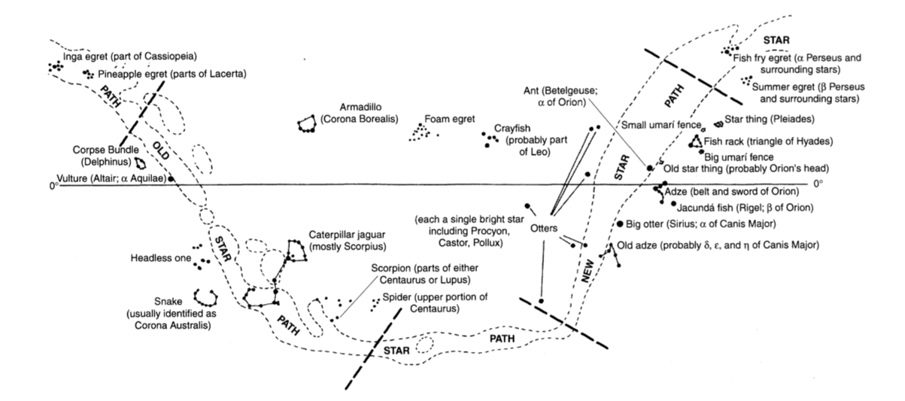
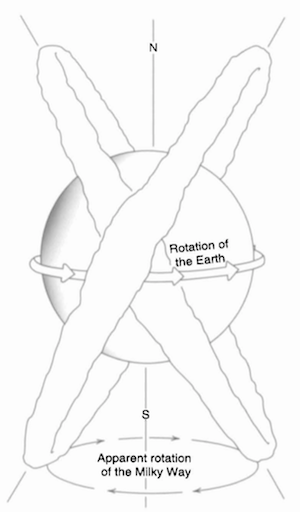
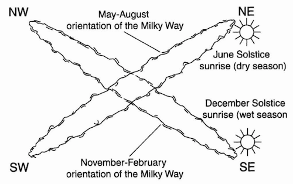
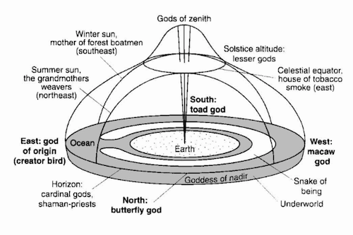
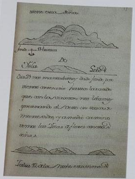
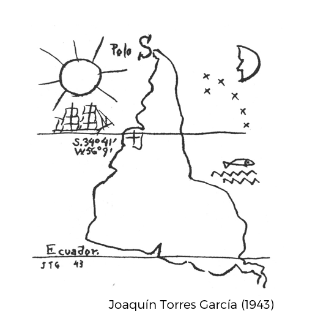
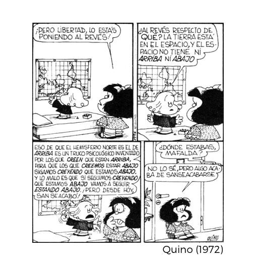


### Earth and sky

The sky and stars are fundamental to mapping in native South American cultures. 

> The sky, both day and night, is perhaps the physical feature most constantly mapped by indigenous people... the relations between the people, animals, and plants on earth are often understood or represented by reference to celestial phenomena. (Whitehead, 304)

 
Constellations of Barasana astronomers. (306)

> native South American ideas show radically different space-time understandings that challenge a rationalist tradition of opposing the “real” and the “imagined.” (303)

> The contrast between modern Western and native South American conceptions might be best summed up by emphasizing that for native South Americans the cosmos and its order constitute a joint project of humanity and divinity. (303)

<!--   -->

The Milky Way’s apparent nightly and seasonal rotation. (Gartner, 261)

> ...in the absence of a bright star near the celestial south pole, Quechua peoples and their ancestors organized the sky by reference to the Milky Way, called Mayu or the “celestial river,” and its apparent cruciform rotations. In a twenty-four-hour period, the Milky Way forms two intersecting intercardinal axes that divide the heavens into quarters. Since the plane of the Milky Way is inclined in relation to the earth’s axis, the stars of one quarter will rise as those of the opposite quarter set as the earth rotates. Astronomical phenomena can be tracked with respect to these quarters, which create a systematic means for the spatial and temporal reckoning of the world and its natural and social rhythms. This principle is central to pre-Columbian spatial reckoning. (260)

### Travel, distance, and wayfinding

Traditional South American conceptions of distances were separated into within-the-horizon, and beyond-the-horizon. On the Achuar of Ecuador, and the Warao of Venezuela: 

> In Achuar culture, the concepts of right and left are used only to indicate an immediate and relative position, longer distances being expressed in the time it takes to cover them. Beyond a local destination, travel time is counted in days or simply becomes “very far,” since the events of a temporally extended journey are unpredictable. (Whitehead, 303)

> On their journeys across the sea the Warao could always remain at the center of the universe as the circle of the horizon traveled with them, and, if need be, they could establish a new home wherever two mountains could serve as the poles of their earth and the abode of the earth-gods. (Wilbert, 148)

Profile of the Warao universe. (Whitehead, 315)

Native cartography includes both the real and imagined places. On the Tupi-Guarani search for guayupia:

> ...the search for places whose existence is indicated by cosmological ideas also forms an element of native cartography. The best-known example of this comes from the southern regions of South America and is part of the Tupi-Guarani cultural tradition. This is the spiritual and physical search for *guayupia*, the Land without Evil. This land of immortality and contentment was a product of the apocalyptic vision of the *karai* (prophet-shamans), and the hope of its discovery provoked mass migrations among the native people, who abandoned their villages and chiefs to follow the *karai* in their mystical quest. Such migrations had a uniformly east-west orientation and for some groups were directly identified with Kandire, the Inka empire toward the west. The arrival of the remnants of one of these millenarian migrations in Chachapoyas, Peru, in 1549, provoked an episode in Spanish mystical exploration, for the Spanish joined the Tupi in searching for the kingdom of Omagua, believing it to be El Dorado. (Whitehead, 313; Clastres, 22-24, 49-51)

### New Horizons

Navigators included harbor sketches to help them find their way.

Shore views typical of those found in navigators’ rutters. (Dym & Offen, 14)

### South Up

Uruguayan artist Joaquin Torres-Garcia established The School of The South in 1934, known as El Taller Torres-Garcia (TTG). In 1935, he delivered an anti-colonial lecture announcing TTG, using this south-up map as visual rhetoric.

> Our geographical position, then, indicates our destiny. And we are responsible for it.

> ...we can *do everything* (now I’m referring to the vital things, those we could call telluric, that give the right aspect to everything); and then, *not exchange what belongs to us for the foreign* (which is unpardonable *snobbery*) but, on the contrary, convert the foreign into our *own substance*. Because I believe that the epoch of colonialism and importation is over (I am now referring to culture more than anything else)... (Ramirez, 55)

The Argentine comic artist Quino used the south-up map in his popular comic strip *Mafalda*.

"But Libertad, don't you see. You are putting it upside down!"
"Upside down with respect to what? The earth is in space, and in space there is no UP or DOWN."
“That thing that the Northern hemisphere is UP is a psychological trick made up by those who believe that they are on TOP, so that those who think they are on the BOTTOM, keep beleiving we are DOWN. The worst is that if we keep thinking we are DOWN we will keep being DOWN. But from today this is over!"
"Where have you been Mafalda?" "I don't know, but from now on, this is it!"

--------

#### References:

Clastres, Helene. *The Land-without-Evil: Tupi-Guarani Prophetism*. Urbana : University of Illinois Press, 1995.

Dym, Jordana & Offen, Karl. *Mapping Latin America: A Cartographic Reader*. Chicago; London: The University of Chicago Press, 2011.

Gartner, William Gustav. "6· Mapmaking in the Central Andes." *Americas* 169 (1970): 647-54.

Ramirez, Mari Carmen. *El Taller Torres-García : the School of the South and its Legacy*. Austin: Published for the Archer M. Huntington Art Gallery, College of Fine Arts, the University of Texas at Austin by the University of Texas Press, 1992.

Whitehead, Neil L. "Indigenous cartography in lowland South America and the Caribbean." *The history of cartography* 2.3 (1998): 301-26.

Wilbert, Johannes. “Geography and Telluric Lore of the Orinico Delta.” *Journal of Latin American Lore* 5 (1979): 129-150