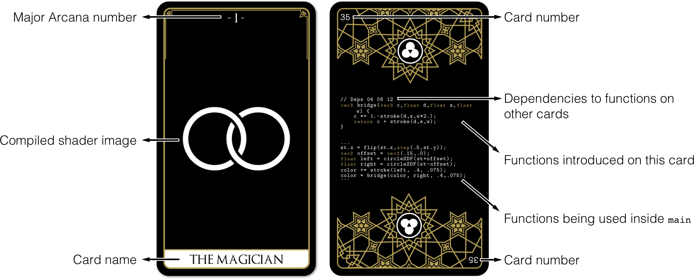
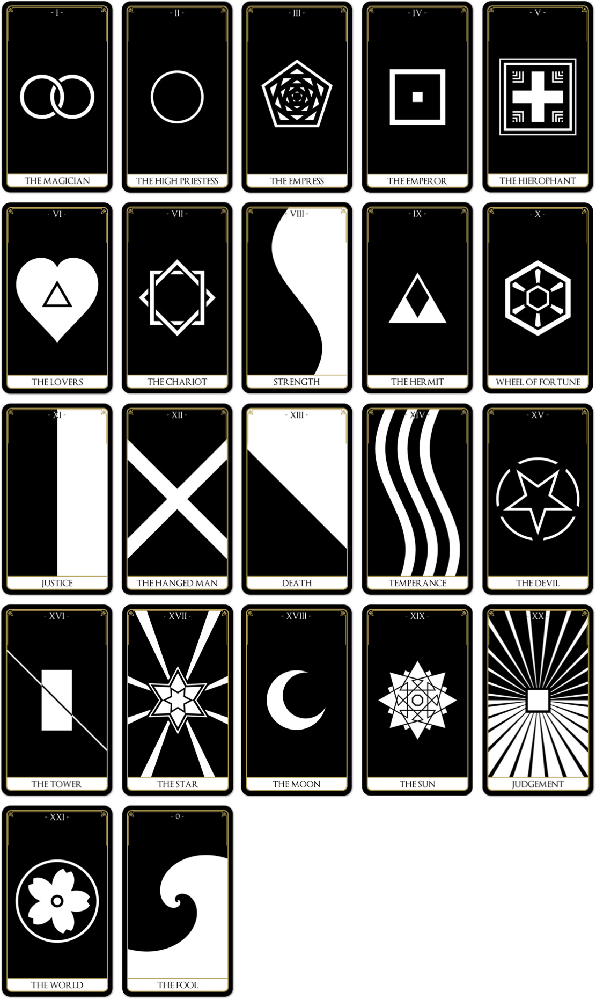

The [PixelSpirit](https://pixelspiritdeck.com/) Elements Deck is a tarot deck for learning GLSL shaders. Each PixelSpirit card has a visual element and its GLSL shader code. The cards are ordered from simplest to most complex, building a library of code functions that combine like a book of spells to form an infinite visual language. This deck is a **tool for learning**, a **library**, and an **oracle**.

In the 50 cards of this deck you will find the 22 major arcana—the ancestral archetypes of the traditional Tarot deck. The wisdom of these powerful cards will guide you on your shader journey.

---

### Cards as Teacher

*If you're just starting to learn GLSL shaders, visit [The Book of Shaders](https://thebookofshaders.com/) for a gentle introduction.*

**How can you use the deck for learning?** Sort the cards according to the numbers on their fronts, so that the card `00` (The Void), is on the top of the pile facing down, exposing the back of the cards. Read the code on the back and think about it, analyze its meaning, imagine how the front will look. Then turn it over and contemplate the result. Repeat this throughout the deck. If you feel lost (which is ok), use the online editor at [The Book of Shaders](https://thebookofshaders.com/) to recode it. Do this with presence and intention.

<!--**Note**: at the beginning of the deck the entire GLSL code is provided, then only the new functions and how to use them.-->

    

        

            
        

        

            
        

    

    

        

            
        

        

            
        

    

    

        

            
        

        

            
        

    

    

        

            
        

        

            
        

    

<!--**Re-Code**: the perfect way to go through the cards teaching yourself shaders is through [this online editor: editor.pixelspiritdeck.com/](http://editor.pixelspiritdeck.com/).-->

---

### Cards as Library

New functions are presented through the progression of the cards. The functions are defined only once, then reused throughout the deck. In this way the deck also is a physical library, a catalog of variations that compose these programmatical archetypes.

**How to use the deck as a library?** Find a shape or visual pattern you want to know more about. Turn the card over to see if a new function is introduced, or if there are *dependencies* to functions on other cards. They will appear as numbers under the comment line that starts with: `// Deps ## ## ##`

Search for the cards with those numbers, and you will find the needed functions.

    

        

            
        

        

            
        

    

    

        

            
        

        

            
        

    

    

        

            
        

        

            
        

    

---

### Cards as Oracle 

Each card refers to an archetype: a luminous symbolic structure that may resonate with your subconscious.

**How to use the deck as an oracle?** Find a quiet space and take your time to define an intention in your mind. Try to describe it as a sentence, or a question. Check with yourself and adjust the words until they make sense to you and feel right. Once you are clear and focused, choose a random card with your left hand. Put the front up, so you can see it clearly and meditate on the meaning. You may have more questions about it, or simply have the feeling that there is something else, if that's the case take another card.

**Note**: For those with experience in Tarot readings, you'll be happy to find the 22 Major Arcana.

---
 