A prism doesn't change the light. It reveals what was already inside it — the full spectrum hidden in what appeared to be a single color.

The tarot works the same way. A question enters undifferentiated, felt but not yet legible. The cards refract it: angles become visible, patterns emerge that weren't apparent before the light passed through the system. The meaning was already there; the cards give it form.

The *Pixel Spirit Deck* is a tarot deck for learning GLSL, the shader programming language that governs how light is computed in real time on every modern screen. Fifty cards, ordered from simplest to most complex. Card 00 is *The Void*: empty, luminous ground from which all other forms emerge. Each card introduces a new function, never redefined; later cards build on earlier ones, referencing them through dependency markers, assembling a composable library in your hands.

Each card carries a visual element on its face, a form made entirely of light, and on its reverse the code that produced it. The two sides occupy completely different registers: one is image, the other is instruction. Yet one generated the other. The code is the archetypal structure, the symbolic DNA of the image encoded as a running program. To read it is to see the skeleton beneath the skin: the grammar of light, made legible.

    

        

            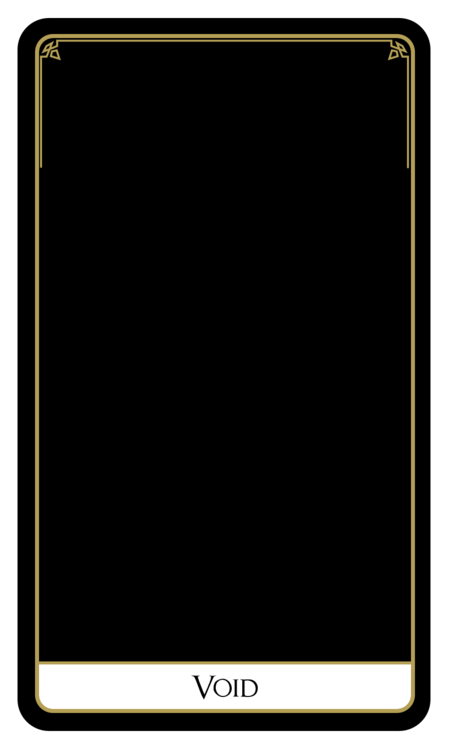
        

        

            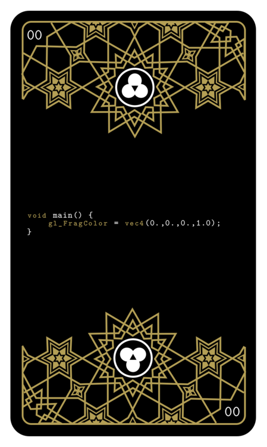
        

    

    

        

            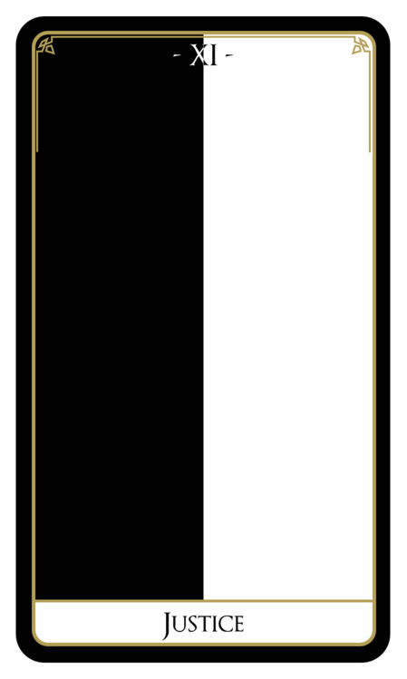
        

        

            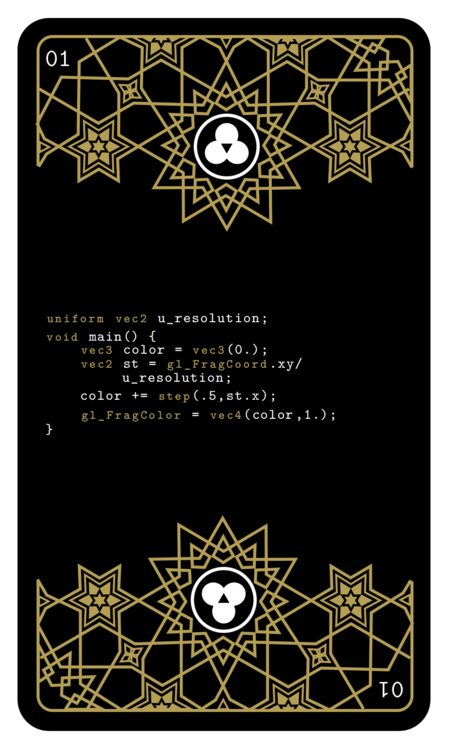
        

    

    

        

            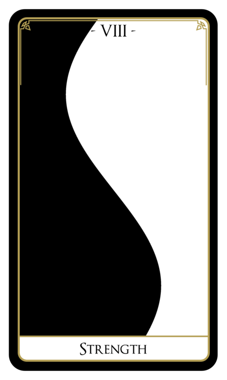
        

        

            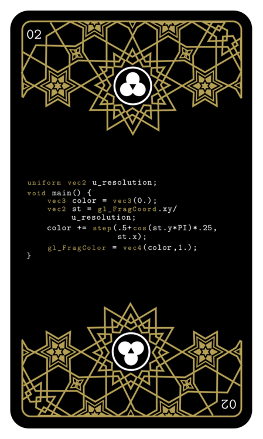
        

    

    

        

            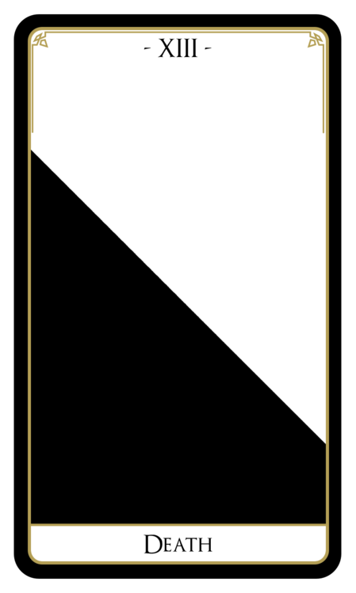
        

        

            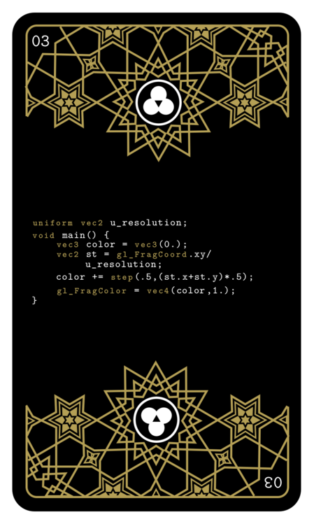
        

    

The twenty-two Major Arcana are woven through the fifty cards, not as decoration but because GLSL and the tarot share a deeper structural logic. Both are prismatic systems: elemental vocabularies in which finite symbols combine into an infinite visual language, asking their practitioners to see forces that operate just beneath the threshold of ordinary perception. The shader function runs identically across every pixel on the screen; what you see is the same instruction, applied infinitely across a field of light. The tarot archetype appears differently in every reading; what you receive is the same deep structure, refracted through the particular question you brought.

To move through the deck — examining the code, forming an image in the mind, then turning the card to see — is to practice this double reading: to hold the image and its generative structure simultaneously, and to feel how completely one was hidden inside the other until you looked.

    

        

            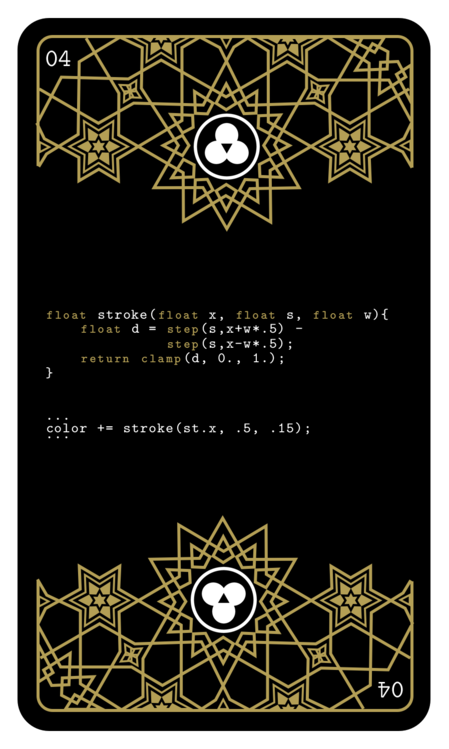
        

        

            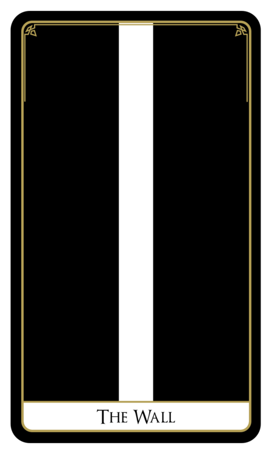
        

    

    

        

            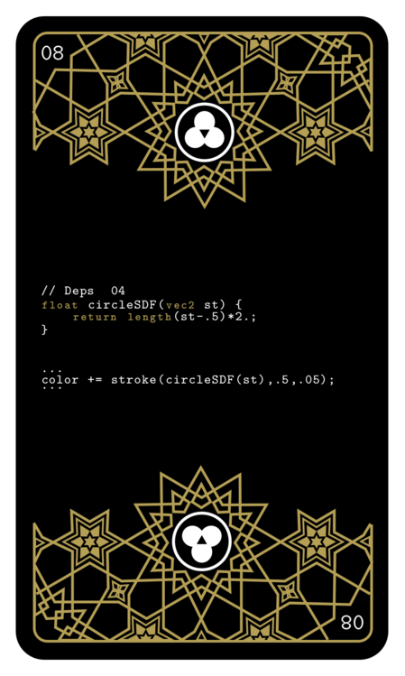
        

        

            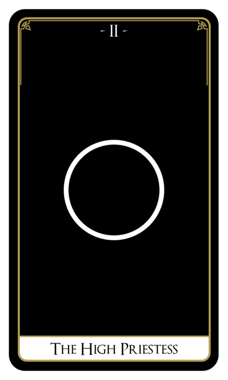
        

    

    

        

            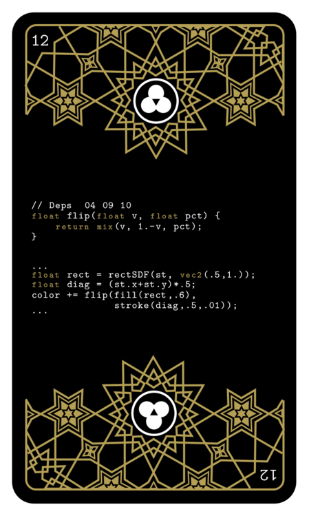
        

        

            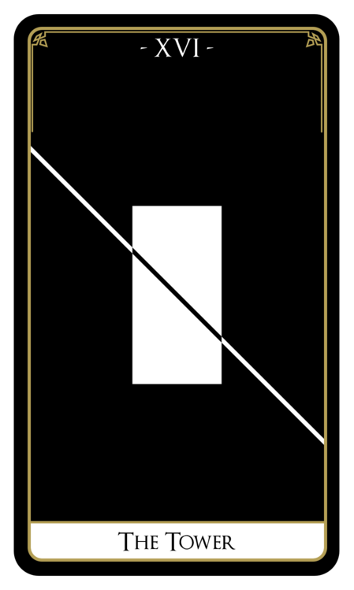
        

    

*Pixel Spirit* grew from the same conviction that produced the [Book of Shaders](https://thebookofshaders.com/): that the language of light should be learnable by anyone willing to begin with card 00. The deck extends that project into something physical — a prism you can hold in your hands, shuffle, spread across a table, and consult without a screen.
