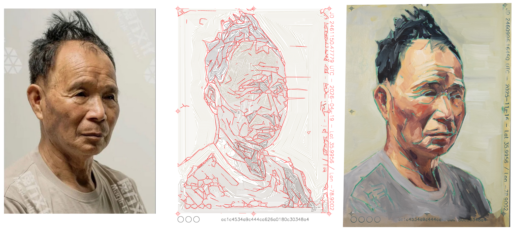

These paintings are hybrids, made by machine and by hand, yet from a single authorship. I write the code and I hold the brush. Both are commanded by the same vision.

The process begins with custom software: a program that uses computer vision to analyze a portrait, translating its structure into vector paths that a plotter draws onto a primed canvas. What emerges is a cartography of the face, its geometry laid bare, waiting.

Then I return with oils. Freed from the obligation of measurement, I enter the painting as a space to inhabit rather than to describe. The machine establishes the scaffold; the hand releases the presence.

This practice places the work within a longer lineage of artists who have embraced emerging technologies not as replacements, but as liberating forces: from the optical devices of the Renaissance, to the material innovations of Flemish oil painting, to the portable paint tube that opened the world to Impressionism. Each reflects a willingness to claim new tools and turn them toward the irreducible work of art-making.

The works that result do not seek to replicate reality, but to evoke it, through a complementary dialogue between systems, materials, and ways of seeing.

