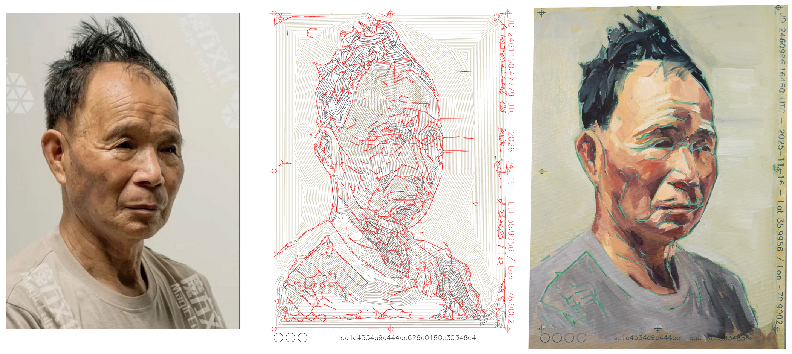

I write the code and I hold the brush. These paintings are made by machine and by hand, but the authorship is unified — both instruments directed by the same vision.

The process begins with custom software: a program that reads the geometry of a portrait — its proportions, its structural relationships — translating that structure into vector paths that a plotter draws onto a primed canvas. What emerges is a cartography of the face, its geometry laid bare, waiting.

Then I return with oils. Freed from the obligation of measurement, I enter the painting as a space to inhabit rather than to describe. The machine establishes the scaffold; the hand releases the presence.

:::wrapfig left
src: ../../2014/skylines/images/14005408208_fbc2fab7ed_b.jpg
title: Skylines
year: 2014
medium: Installation detail at gallery
link: ../../2014/skylines/
:::

These portraits continue an exploration of drawing machines begun with [Skylines in 2014](../../2014/skylines/skylines.php?v=01), for which I constructed a wall plotter that slowly reveals an image through multiple tireless traces of charcoals commanded by a custom software that translate a live video feed of a city landscape into lines. This practice reaches back into a longer lineage of artists who have embraced emerging technologies not as replacements, but as liberating forces: from the optical devices of the Renaissance, to the material innovations of Flemish oil painting, to the portable paint tube that opened the world to Impressionism. Each reflects a willingness to claim new tools and turn them toward the irreplaceable act of art-making.

What the machine cannot give the painting is what the hand is for: the weight of encounter, the residue of attention, the specific moment when a face stops being data and becomes someone.

