Weaver is an interactive artifact that allows you to connect with someone across time and space by watching the same section of the night sky. Like sacred story tellings, rituals, prayers, and meditations, this artifact invites you to step out of linear time and immanent experience, and into one that made by the invisible strings that connect us all.

Two overlapping star maps of the sky. One per observer. Each one is differentiated by a unique color, mirroing the night sky from a different geographical location and date. The overlapping section is the common portion of the sky where observers can see the same stars and constellation.

Each star map has a polar projection of the sky. Meaning the stars close to the outer edge are closer to the horizon (notice the letters of the four cardinal directions) while those at the center of the chart are directly above the head of the observer.

At the bottom you can see two globes showing each of the observers locations. If at least one of the observers is not in the present time, you will see a timeline at the top, showing the different dates and times.

Both the map of the sky and the globes are interactive. You can drag the skymaps to change the time and date of the observers. The globes can be rotated to select other locations.

In order to share this with someone you wish to connect with, you will need to provide a specific date and location by clicking on the gear in the top right corner.

There, you can also customize the names and other parameters for each one of the observers.

Once you are done, apply the changes and share the unique URL with the other person.
