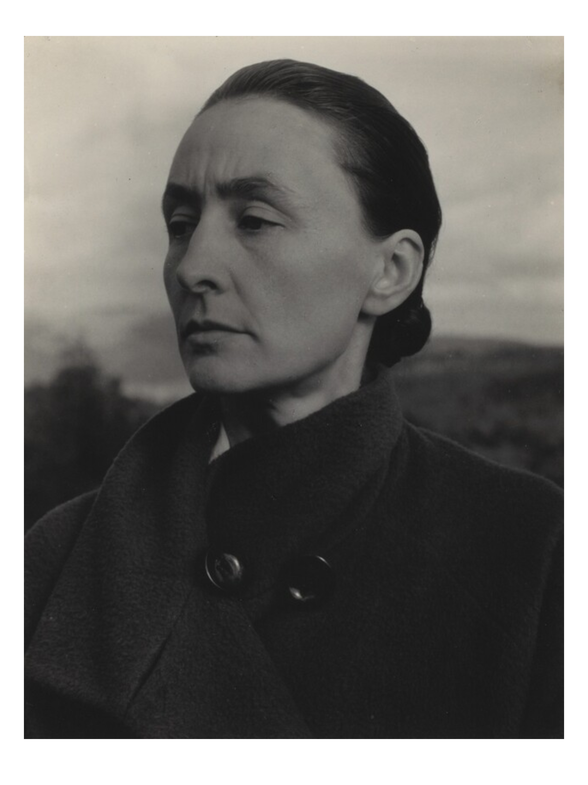
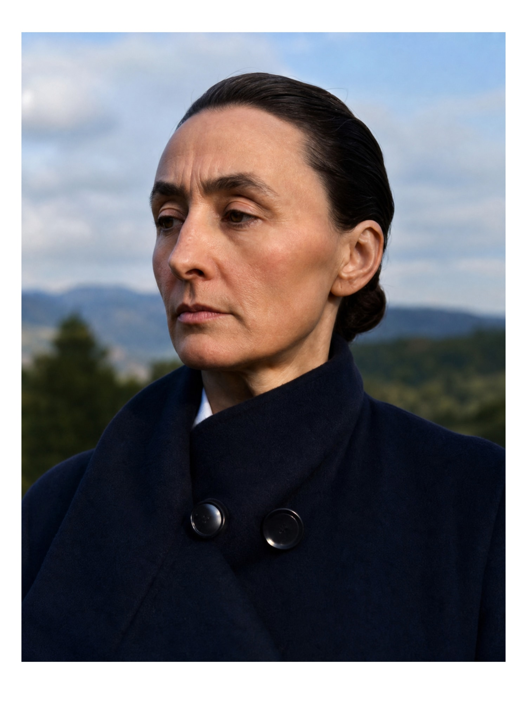
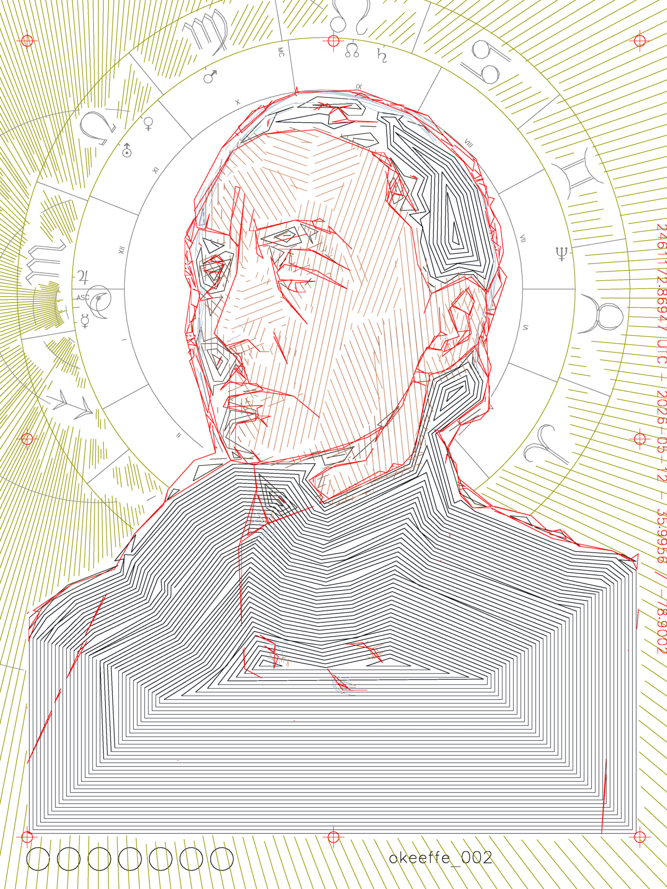
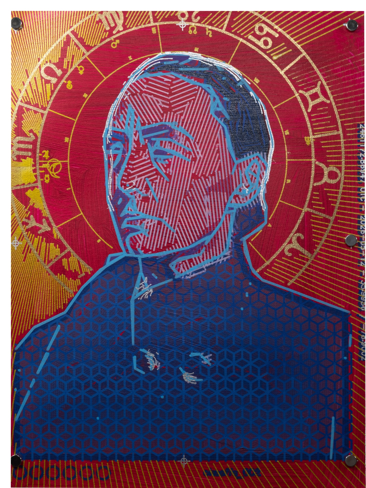
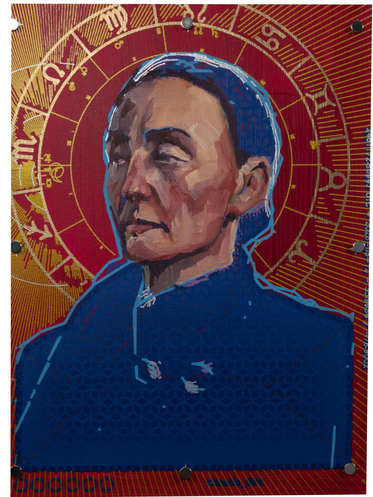

In Latin America, it is common to receive the name of the saint whose feast day coincides with one’s birth. To ask for someone’s santo is, in effect, to ask for their birthday. This custom reflects a deep cultural belief: that the saint linked to your day of birth becomes a protector, a guide, and a source of inspiration. Saints, historical figures revered for their moral virtue and spiritual significance, are understood to transcend linear time. Through their acts of compassion and faith, they enter a more circular, mythological temporality, becoming enduring presences within the collective imagination of Christianity.

I was raised in a Catholic family. My grandfather used to read to me from a red book in his study, a compendium of saints’ lives. Alongside brief narratives, there were illustrations, each saint marked by a halo, captured at the pivotal moment of transformation when the ordinary gave way to the transcendent. Again and again, these stories returned to a common thread, self-sacrifice, service, and devotion to others. The halo functioned as a visual language for this metaphysical shift.

That ethos of service extended into my family’s expectations. Professions such as law, medicine, and engineering were valued as pathways toward a life of usefulness and contribution. In my lineage, I cannot trace a single artist. There is one fragile exception, my maternal great-grandmother, a poet who reportedly burned all her writings upon marriage, as though creativity were a deviation to be corrected, a path to be relinquished in favor of duty.

<!-- :::wrapfig right
src: okeeffe_005.jpg
caption: Installation detail, 2026
link: /2026/santos/
::: -->

This series of portraits emerges from a personal search for an alternative lineage, one composed of figures whose service to humanity is enacted through creation. These are individuals committed to the discipline of imagination, capable of translating the invisible into form, and of reshaping the world through beauty, wonder, and possibility.

If there is a creator who invites us into existence as co-creators, then this lineage of artists stands as a kind of secular sainthood. They are not exemplars of moral virtue in the traditional sense, but they are, for me, figures of devotion, visionaries with whom I seek communion and dialogue.

    
    
    
    
    

 

Technically, these portraits represent the next step in an [experimental process I began with Hybrids](../../2025/hybrids/). My process brings together the forces of machine and hand, code and gesture. Like their subjects, the works exist as syntheses: of the material and the immaterial, the earthly and the cosmic, the known and the intuited. They stand as reflections on creativity’s enduring capacity to transcend boundaries and connect us to something beyond ourselves.