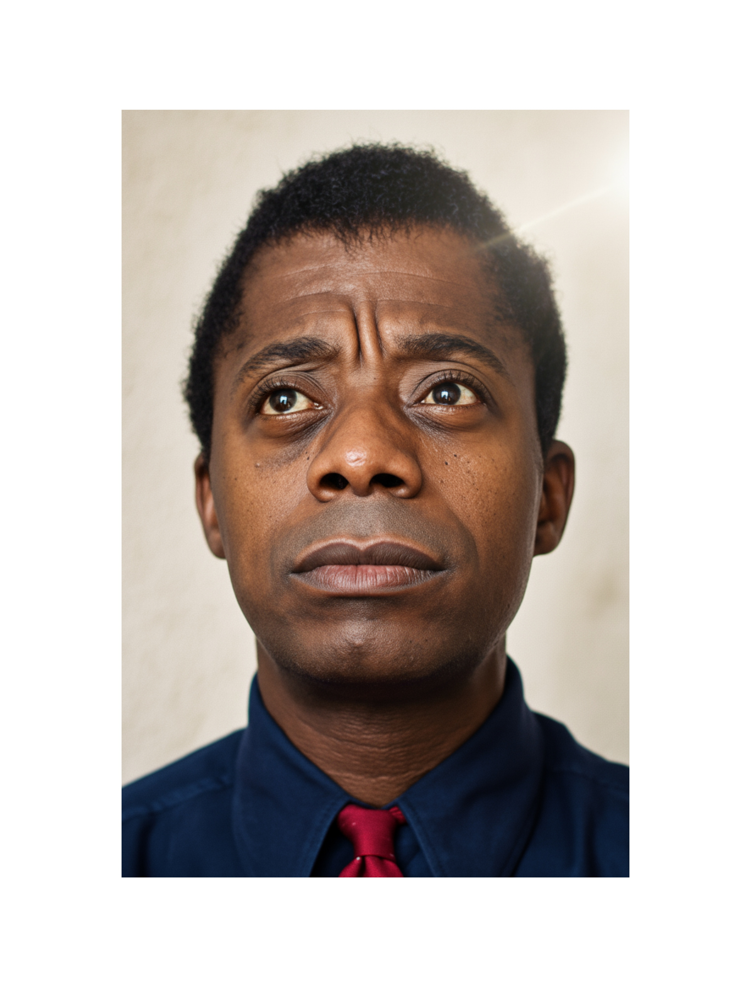
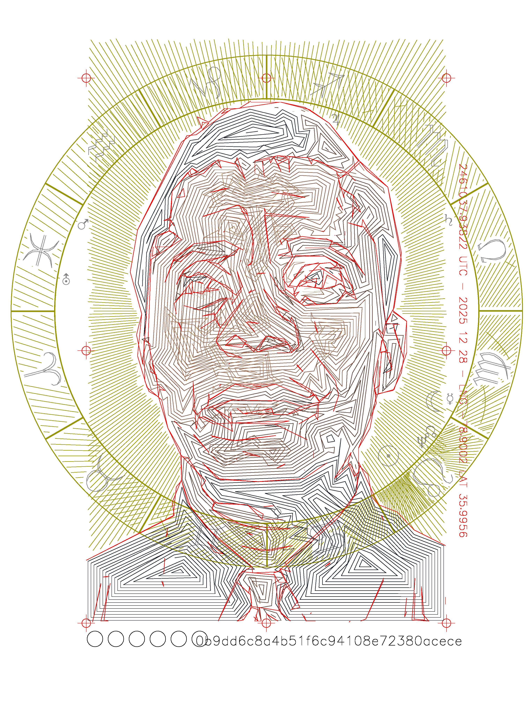
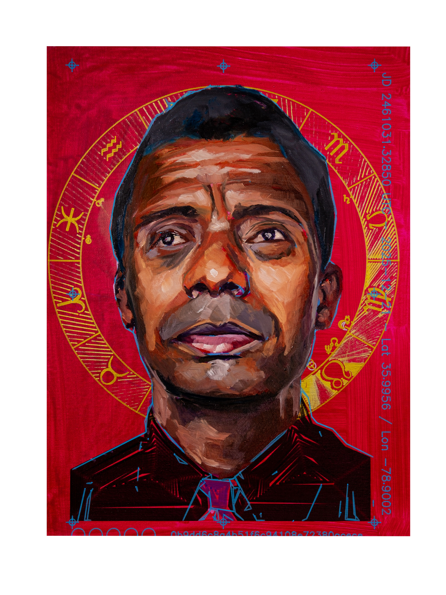

--- RAW ---

In latino-america, is common to received the name of the saint celebrated on your birthday. Relatedly asking for someone's "santo" is another way of ask for the birthday of someone. This strong connection between birthdays and christian saints is rutted on the belief that the saint of your birthday is a protector, a guide, and a source of inspiration. Saints, are historic figures whose lives are celebrated for their moral virtues and spiritual significance. Through their deeds, compassion and faith, they transcend linear time to enter to the circular time of the eternal and mythological. By becoming role models they entered into the bastion of the collective imaginary of Christianity.  

I come from a catholic family. My grandfather used to read me the story of the saint, from a red book he had on his studio. Together with a short story of their live, it had sometimes some drawing of the saints with it halo in a crucial moment of their life where they convert them self from simple humans to more transcendent beings. There always seems to be the element of self-sacrifice, gesture to the common good and service to others. The halo on their drawings was the clear representation of that metaphysical transformation. Aligned to that, on family valued professions that allow that same gesture toward service. Almost everyone in my linage is a lawyers, a doctor or and engineer. Those where the paths more likely to lead you to a useful life of service to others. I can't trace a single artist. There is bage exception of the paternal grandmother of my mother who was a poet, but apparently burn all her writings when she married. As if some sort of shameful path that needs to be forked in favor of raising my grandfather (the same that read me the saint stories). 

This series of portraits is my personal search for a better legacy of ancestors and role models. One made of those who services to humanity is through the act of creation. Through the diligent and persistent commitment to their imagination and their ability to channel the invisible into form, to shape this world with beauty, wonder, and a renewed sense of possibility. 
We inhabit the world they help to shape, they propel us into action, they awaken our soul, they shepherd our consciousness and they guide us beyond the superfluous somnolence of the obvious.

If there is a god, creator of the universe, which invite us to this world as co-creators. These fantastic lineage of artist is as good as any other saint. They are not moral example of virtue, but they are my own personal list of inspiring figures, of talented visionaries on which I want to be on communion and in dialog. 

Technically, these portraits is the next step of the experimental portrait process I started with Hybrids. A proces that combines the forces of machine and hand, code and gesture, the objective and the subjective. Like their subjects, they exist as syntheses, of the material and immaterial, the earthly and the cosmic, the known and the intuited. They stand as reflections on creativity’s enduring capacity to transcend boundaries and connect us to something beyond ourselves.

--- Edited by CHAT GPT ---

In Latin America, it is common to receive the name of the saint whose feast day coincides with one’s birth. To ask for someone’s santo is, in effect, to ask for their birthday. This custom reflects a deep cultural belief: that the saint linked to your day of birth becomes a protector, a guide, and a source of inspiration. Saints—historical figures revered for their moral virtue and spiritual significance—are understood to transcend linear time. Through their acts of compassion and faith, they enter a more circular, mythological temporality, becoming enduring presences within the collective imagination of Christianity.

I was raised in a Catholic family. My grandfather used to read to me from a red book in his study—a compendium of saints’ lives. Alongside brief narratives, there were illustrations: each saint marked by a halo, captured at the pivotal moment of transformation, when the ordinary gave way to the transcendent. Again and again, these stories returned to a common thread—self-sacrifice, service, devotion to others. The halo functioned as a visual language for this metaphysical shift.

That ethos of service extended into my family’s expectations. Professions such as law, medicine, and engineering were valued as pathways toward a life of usefulness and contribution. In my lineage, I cannot trace a single artist. There is one fragile exception: my maternal great-grandmother, a poet, who reportedly burned all her writings upon marriage—as though creativity were a deviation to be corrected, a path to be relinquished in favor of duty.

This series of portraits emerges from a personal search for an alternative lineage—one composed of figures whose service to humanity is enacted through creation. These are individuals committed to the discipline of imagination, capable of translating the invisible into form, and of reshaping the world through beauty, wonder, and possibility.

We inhabit the worlds they have helped to build. Their work compels us, awakens us, and draws us beyond the inertia of the obvious. They expand perception, inviting us into deeper forms of attention and consciousness.

If there is a creator who invites us into existence as co-creators, then this lineage of artists stands as a kind of secular sainthood. They are not exemplars of moral virtue in the traditional sense, but they are, for me, figures of devotion—visionaries with whom I seek communion and dialogue.

Technically, these portraits represent the next step in an experimental process I began with Hybrids—a practice that brings together the forces of machine and hand, code and gesture, the objective and the subjective. Like their subjects, the works exist as syntheses: of the material and the immaterial, the earthly and the cosmic, the known and the intuited. They stand as reflections on creativity’s enduring capacity to transcend boundaries and connect us to something beyond ourselves.

--- OLD ---

Inspired by the Christian tradition of highlighting those whose life was considered a model of service and devotion, this series honors those whose imagination shaped our world, those who channel the invisible into form, bringing beauty, wonder, and a renewed sense of possibility.

This series is not about their moral character but their legacy as shapers of reality. Awakeners of the soul, shepherds of consciousness, guiding us beyond the superfluous somnolence of the obvious.

These portraits are a meditation on the nature of creativity itself. A celebration of those who dared to see differently, to imagine what did not yet exist, and to give it form. They are a reminder that we are all capable of such acts of creation, and that by honoring those who came before us, we can find inspiration to forge our own path forward.

Each portrait emerges through an [experimental process, a dialogue of complementary forces](../../2025/hybrids/). It begins with mapping: the detection of landmarks and their relationships. This structural framework expands into a symbolic dimension through a custom astronomical code library, generating precise configurations of the night sky at the moment of each subject’s birth.

A plotter inscribes this dual cartography, of the individual and their celestial context, onto the canvas. From there, the work is finished with oils and brushes, inhabiting the surface as a site of sensorial exploration, where structure gives way to intuition.

    
    
    

These paintings are the product of dual forces: hybrid portraits shaped by both machine and hand, code and gesture, the objective and the subjective. Like their subjects, they exist as syntheses, of the material and immaterial, the earthly and the cosmic, the known and the intuited. They stand as reflections on creativity’s enduring capacity to transcend boundaries and connect us to something beyond ourselves.
