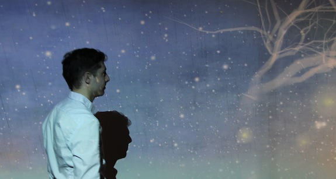

<!--  -->

**Patricio Gonzalez Vivo** (b. 1982, Buenos Aires) is a multidisciplinary artist working at the intersection of painting, computation, and symbolic systems. His practice centers on the creation of artifacts of perception, tools, images, and experiences that translate between the measurable and the ineffable. Through these works, he explores how we construct meaning, memory, and presence across material and digital domains.

Trained initially in clinical psychology and expressive arts therapy, Gonzalez Vivo’s early engagement with inner experience continues to inform his artistic language. In 2012, he relocated to the United States to pursue an MFA in Design & Technology at Parsons School of Design, where his focus shifted toward the development of computational and perceptual systems as artistic media.

His body of work spans paintings, generative systems, interactive installations, and symbolic interfaces; ranging from machine-assisted portraiture and real-time cosmological visualizations to pedagogical artifacts such as tarot-based coding decks. Across these forms, his work reflects a sustained inquiry into perception as both a technical and poetic act: how images are constructed, how consciousness is mediated, and how reality is continually reinterpreted through tools.

A defining aspect of his practice is tool-making. Patricio develops and releases open-source libraries and platforms that extend the possibilities of digital art, positioning software itself as both medium and infrastructure. His widely influential [Book of Shaders](https://thebookofshaders.com/) has become a foundational resource for artists working with real-time graphics, while tools such as [GlslViewer](https://github.com/patriciogonzalezvivo/glslViewer), [glslCanvas](https://github.com/patriciogonzalezvivo/glslCanvas) and [glslPipeline](https://github.com/patriciogonzalezvivo/glsl-pipeline/) -and libraries such as [Lygia](https://github.com/patriciogonzalezvivo/lygia), [Vera](https://github.com/patriciogonzalezvivo/vera), [Berthe](https://github.com/patriciogonzalezvivo/berthe), and [Hypatia](https://github.com/patriciogonzalezvivo/hypatia) are used globally as instruments for creative exploration. For the artist, this open dissemination is not ancillary but integral, a form of shared authorship and cultural contribution.

His work has been exhibited and presented internationally at platforms such as [EYEO](http://eyeofestival.com/), [Resonate](http://resonate.io/), [GROW](https://www.grow.paris/), [FILE](http://file.org.br/), [Espacio Fundación Telefónica](http://espacio.fundaciontelefonica.com/), [BrightMoments](https://www.brightmoments.io/), [FlyingTokyo](https://youtu.be/aIjeF9QgH-Q), [DotDotDot](https://www.dotdotdot.it/conn/graphics-machine-learning-patricio.php) and [FASE](http://encuentrofase.com.ar/). He has delivered talks and lectures at institutions including the [MIT Media Lab](https://www.media.mit.edu/people/zachl/overview/), [Carnegie Mellon University, Frank-Ratche Studio for Creative Inquiry](https://www.cmu.edu/cfa/studio/) and Politecnico di Milano. He has taught at [Parsons School of Design](http://www.newschool.edu/parsons/mfa-design-technology/), [ITP NYU](http://tisch.nyu.edu/itp), [SFPC (School for Poetic Computation)](http://sfpc.io/), and the Instituto Universitario Nacional de Arte in Argentina.

Across mediums and contexts, his practice proposes a contemporary synthesis: where code and gesture, machine, and hand, analysis, and intuition converge, offering new ways of seeing, and new conditions for experience.